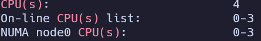
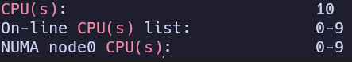
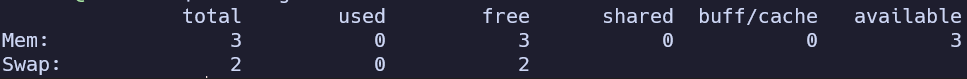
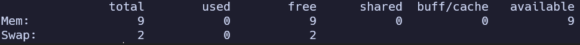

# KN01

## Screenshot mit der Konsolen-Ausgabe der CPUs bei **weniger** CPU als Ihr Host-System hat.
Mit dem command ``lscpu | grep "CPU(s)"``

## Screenshot mit der Konsolen-Ausgabe der CPUs (oder Fehlermeldung des Host-Systems) bei **mehr** CPU als Ihr Host-System hat.
Mit dem command ``lscpu | grep "CPU(s)"``

- Ich konnte nicht mehr CPUs auswählen, als mein Host-Gerät.

## Screenshot mit der Konsolen-Ausgabe des RAM bei **weniger** RAM als Ihr Host-System hat.
Mit dem command ``free -g``

## Screenshot mit der Konsolen-Ausgabe der RAM (oder Fehlermeldung des Host-Systems) bei **mehr** RAM als Ihr Host-System hat.
Mit dem command ``free -g``

- Ich konnte nicht mehr Memory auswählen, als mein Host-Gerät.

## Erklärung wieso Sie Fehlermeldungen kriegen oder Erklärung wie es möglich ist, dass Sie mehr Ressourcen zuteilen können als Ihr Host-System hat.

- Funktioniert in meinem Fall nicht, vermutlich, weil man nicht mehr Ressourcen zuweisen kann, als tatsächlich vorhanden sind.
