# KN02

## Lab 4.1 - EC2

### HTML-Seite, inkl. URL

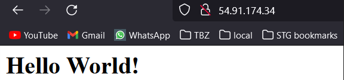

### Liste der EC2-Instanzen

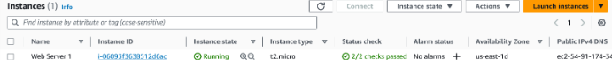

### Details der Web Server-Instanz (öffentliche IP sichtbar)

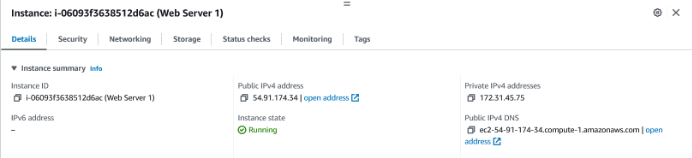

### Security-Group: Liste der Inbound-Regeln.

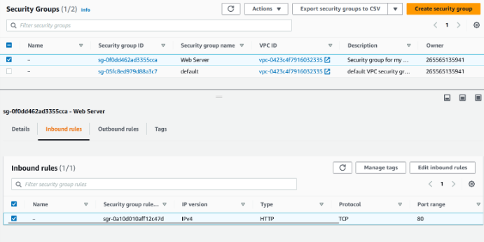

## Lab 4.2 - S3

### Liste der Buckets.

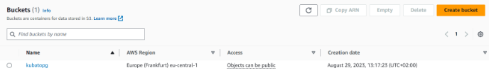
### HTML-Seite, inkl. URL.

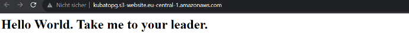

### Liste der Dateien im Bucket.

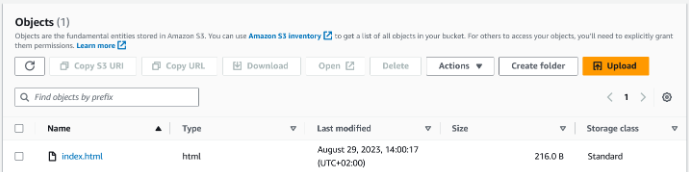

### Eigenschaften von "Static website hosting".

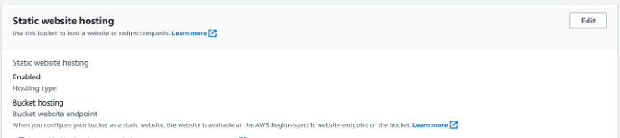

## Zugriff mit SSH-Key

### Screenshot mit dem ssh-Befehl und des Resultats unter Verwendung des ersten Schlüssels
mit dem command ``ssh -i Ragnarok.pem ubuntu@54-81-18-80.compute-1.amazonaws.com``

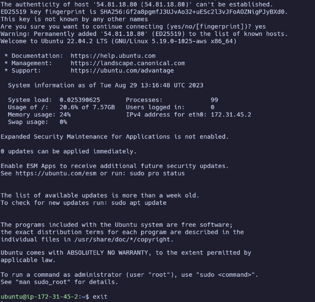

### Screenshot mit dem ssh-Befehl und des Resultats unter Verwendung des zweiten Schlüssels

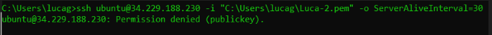
das bild habe ich von einem kollegen bekommen da ich vergessen habe dieses zu machen.

### Screenshot der Instanz-Detail (oder Liste), so dass der verwendete Schlüssel sichtbar ist.

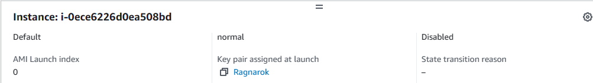

## Installation von Web- und Datenbankserver

### Erstellen Sie Screenshots der funktionierenden Webseiten (mit sichtbarer URL)

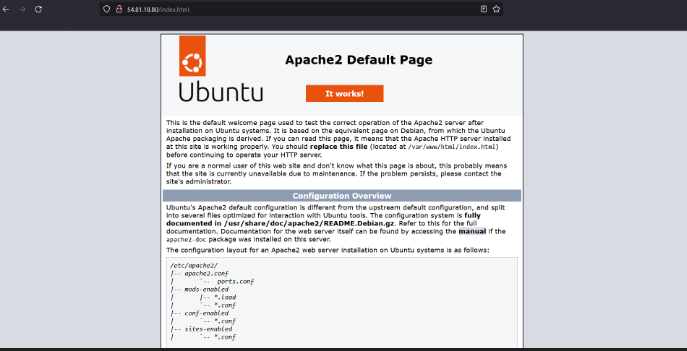

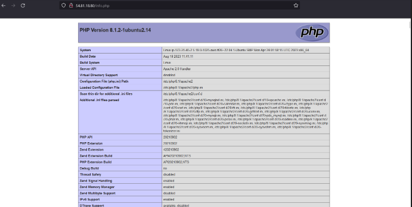

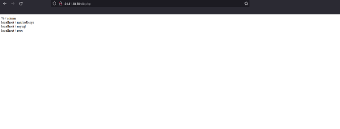
