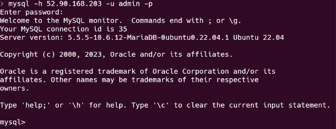

# KN03

## Cloud-init Datei Verstehen

```yml
#cloud-config
users:
  - name: ubuntu # Definiert einen Benutzer mit dem Namen "ubuntu".
    sudo: ALL=(ALL) NOPASSWD:ALL # Ermöglicht dem Benutzer, sudo-Befehle ohne Passwort einzugeben.
    groups: users, admin # Fügt den Benutzer zu den Gruppen "users" und "admin" hinzu.
    home: /home/ubuntu # Legt das Heimatverzeichnis des Benutzers auf "/home/ubuntu" fest.
    shell: /bin/bash # Setzt die Standard-Shell des Benutzers auf "/bin/bash".
    ssh_authorized_keys: # Fügt den öffentlichen SSH-Schlüssel zur Liste der autorisierten Schlüssel hinzu.
      - ssh-rsa AAAAB3NzaC1yc2EAAAADAQABAAABAQCGavILd6smIywMqIQDLD1kA57JQ7+Z9UCexcrWdsFk6/4FayqhJU4xUhJVqKlJmR2HI8gRczfwEA5RLE9iUk6+AD622CSRgNBMVFahxcupiHZwLdssVAq8sZXi4+mx+mCzKdc6dpSdsFOsEE9Ny+l2kx1Sv/cPyjwp204+ak4VvJb8XEOCXIPqEicNTStHjsHWn3UV+NHMJNueZW4OfHeK3VikM8fb8NkOkSl34B0kgdzmYk1fsXNOfan0maqX288f3kWo/iq3ZWmkePvPmlhsjYniZkpyuCFeYwvvju4K23DaSsrycNe/DWhdQUvZQ0MQG+PvC47Yrc5SHsYsBK2p aws-key
ssh_pwauth: false # Deaktiviert die SSH-Passwortauthentifizierung
disable_root: false # Erlaubt den Zugriff auf das Root-Konto.
package_update: true # Aktualisiert das Paketrepository, um die neuesten Paketinformationen abzurufen.
packages: # Installiert die Pakete "curl" und "wget" mithilfe des Paketmanagers.
  - curl
  - wget
```

##  SSH-Key und Cloud-init

### Ihre angepasste Cloud-init Konfiguration als Datei im Git-Repository.

[YAML Datei](cloud-init.yaml)

### Output Screenschot


### Screenshot mit dem ssh-Befehl und des Resultats unter Verwendung des zweiten Schlüssels.


### Screenshot mit dem Auszug aus dem Cloud-Init-Log.


## Auftrennung von Web- und Datenbankserver

### Template cloud-init

[Template Cloud Init](cloud-init-template.yaml)

```yml
#cloud-config
users:
  - name: ubuntu
    sudo: ALL=(ALL) NOPASSWD:ALL
    groups: users, admin
    home: /home/ubuntu
    shell: /bin/bash
    ssh_authorized_keys:
      - ssh-rsa AAAAB3NzaC1yc2EAAAADAQABAAABAQCGavILd6smIywMqIQDLD1kA57JQ7+Z9UCexcrWdsFk6/4FayqhJU4xUhJVqKlJmR2HI8gRczfwEA5RLE9iUk6+AD622CSRgNBMVFahxcupiHZwLdssVAq8sZXi4+mx+mCzKdc6dpSdsFOsEE9Ny+l2kx1Sv/cPyjwp204+ak4VvJb8XEOCXIPqEicNTStHjsHWn3UV+NHMJNueZW4OfHeK3VikM8fb8NkOkSl34B0kgdzmYk1fsXNOfan0maqX288f3kWo/iq3ZWmkePvPmlhsjYniZkpyuCFeYwvvju4K23DaSsrycNe/DWhdQUvZQ0MQG+PvC47Yrc5SHsYsBK2p aws-key
      - ssh-rsa AAAAB3NzaC1yc2EAAAADAQABAAABAQC0WGP1EZykEtv5YGC9nMiPFW3U3DmZNzKFO5nEu6uozEHh4jLZzPNHSrfFTuQ2GnRDSt+XbOtTLdcj26+iPNiFoFha42aCIzYjt6V8Z+SQ9pzF4jPPzxwXfDdkEWylgoNnZ+4MG1lNFqa8aO7F62tX0Yj5khjC0Bs7Mb2cHLx1XZaxJV6qSaulDuBbLYe8QUZXkMc7wmob3PM0kflfolR3LE7LResIHWa4j4FL6r5cQmFlDU2BDPpKMFMGUfRSFiUtaWBNXFOWHQBC2+uKmuMPYP4vJC9sBgqMvPN/X2KyemqdMvdKXnCfrzadHuSSJYEzD64Cve5Zl9yVvY4AqyBD aws-key
ssh_pwauth: false
disable_root: false
package_update: true
packages:
  - curl
  - wget

runcmd:
#  - echo example

# write_files:
```

### Beweisführung DB Server

#### Shell verbindung von Hostsystem.


#### Telnet verbindung von Hostsystem.


#### Fügen Sie die Cloud-Init-Datei im Git-Repository hinzu.

```yml
#cloud-config
users:
  - name: ubuntu
    sudo: ALL=(ALL) NOPASSWD:ALL
    groups: users, admin
    home: /home/ubuntu
    shell: /bin/bash
    ssh_authorized_keys:
      - ssh-rsa AAAAB3NzaC1yc2EAAAADAQABAAABAQCGavILd6smIywMqIQDLD1kA57JQ7+Z9UCexcrWdsFk6/4FayqhJU4xUhJVqKlJmR2HI8gRczfwEA5RLE9iUk6+AD622CSRgNBMVFahxcupiHZwLdssVAq8sZXi4+mx+mCzKdc6dpSdsFOsEE9Ny+l2kx1Sv/cPyjwp204+ak4VvJb8XEOCXIPqEicNTStHjsHWn3UV+NHMJNueZW4OfHeK3VikM8fb8NkOkSl34B0kgdzmYk1fsXNOfan0maqX288f3kWo/iq3ZWmkePvPmlhsjYniZkpyuCFeYwvvju4K23DaSsrycNe/DWhdQUvZQ0MQG+PvC47Yrc5SHsYsBK2p aws-key
      - ssh-rsa AAAAB3NzaC1yc2EAAAADAQABAAABAQC0WGP1EZykEtv5YGC9nMiPFW3U3DmZNzKFO5nEu6uozEHh4jLZzPNHSrfFTuQ2GnRDSt+XbOtTLdcj26+iPNiFoFha42aCIzYjt6V8Z+SQ9pzF4jPPzxwXfDdkEWylgoNnZ+4MG1lNFqa8aO7F62tX0Yj5khjC0Bs7Mb2cHLx1XZaxJV6qSaulDuBbLYe8QUZXkMc7wmob3PM0kflfolR3LE7LResIHWa4j4FL6r5cQmFlDU2BDPpKMFMGUfRSFiUtaWBNXFOWHQBC2+uKmuMPYP4vJC9sBgqMvPN/X2KyemqdMvdKXnCfrzadHuSSJYEzD64Cve5Zl9yVvY4AqyBD aws-key
ssh_pwauth: false
disable_root: false
package_update: true
packages:
  - mariadb-server
runcmd:
  - sudo a2enconf adminer
  - sudo mysql -sfu root -e "GRANT ALL ON *.* TO 'admin'@'%' IDENTIFIED BY 'password' WITH GRANT OPTION;"
  - sudo sed -i 's/127.0.0.1/0.0.0.0/g' /etc/mysql/mariadb.conf.d/50-server.cnf
  - sudo systemctl restart mariadb.service
```

### Beweisführung Webserver

#### index.html


#### info.php


#### db.php


#### adminer


#### Fügen Sie die Cloud-Init-Datei im Git-Repository hinzu.

[Cloud-Init-Datei](./src/cloud-init-web.yaml)

```yml
#cloud-config
users:
  - name: ubuntu
    sudo: ALL=(ALL) NOPASSWD:ALL
    groups: users, admin
    home: /home/ubuntu
    shell: /bin/bash
    ssh_authorized_keys:
      - ssh-rsa AAAAB3NzaC1yc2EAAAADAQABAAABAQCGavILd6smIywMqIQDLD1kA57JQ7+Z9UCexcrWdsFk6/4FayqhJU4xUhJVqKlJmR2HI8gRczfwEA5RLE9iUk6+AD622CSRgNBMVFahxcupiHZwLdssVAq8sZXi4+mx+mCzKdc6dpSdsFOsEE9Ny+l2kx1Sv/cPyjwp204+ak4VvJb8XEOCXIPqEicNTStHjsHWn3UV+NHMJNueZW4OfHeK3VikM8fb8NkOkSl34B0kgdzmYk1fsXNOfan0maqX288f3kWo/iq3ZWmkePvPmlhsjYniZkpyuCFeYwvvju4K23DaSsrycNe/DWhdQUvZQ0MQG+PvC47Yrc5SHsYsBK2p aws-key
      - ssh-rsa AAAAB3NzaC1yc2EAAAADAQABAAABAQC0WGP1EZykEtv5YGC9nMiPFW3U3DmZNzKFO5nEu6uozEHh4jLZzPNHSrfFTuQ2GnRDSt+XbOtTLdcj26+iPNiFoFha42aCIzYjt6V8Z+SQ9pzF4jPPzxwXfDdkEWylgoNnZ+4MG1lNFqa8aO7F62tX0Yj5khjC0Bs7Mb2cHLx1XZaxJV6qSaulDuBbLYe8QUZXkMc7wmob3PM0kflfolR3LE7LResIHWa4j4FL6r5cQmFlDU2BDPpKMFMGUfRSFiUtaWBNXFOWHQBC2+uKmuMPYP4vJC9sBgqMvPN/X2KyemqdMvdKXnCfrzadHuSSJYEzD64Cve5Zl9yVvY4AqyBD aws-key
ssh_pwauth: false
disable_root: false
package_update: true
packages:
  - curl
  - wget
  - apache2
  - php
  - libapache2-mod-php
  - php-mysqli
  - adminer
runcmd:
  - sudo a2enconf adminer
  - sudo systemctl restart apache2
write_files:
  - path: /var/www/html/info.php
    content: |
      <?php

      // Show all information, defaults to INFO_ALL
      phpinfo();

  - path: /var/www/html/db.php
    content: |
      <?php
      //database
      $servername = "52.90.168.203";
      $username = "admin";
      $password = "password";
      $dbname = "mysql";

      // Create connection
      $conn = new mysqli($servername, $username, $password, $dbname);
      // Check connection
      if ($conn->connect_error) {
        die("Connection failed: " . $conn->connect_error);
      }

      $sql = "select Host, User from mysql.user;";
      $result = $conn->query($sql);
      while($row = $result->fetch_assoc()){
        echo($row["Host"] . " / " . $row["User"] . "<br />");
      }
      //var_dump($result);
      ?>
```
