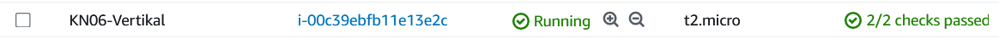

# KN06

## Installation App

### Kurze Erklärung in eigenen Worten was ein Reverse Proxy ist.

Ein Reverse Proxy ist ein Server oder eine Software, die Anfragen von Clients entgegennimmt und sie an die richtigen Server weiterleitet. Er dient als "Load Balancer".

### Screenshot der zeigt, dass Sie die Swagger-URL aufrufen können.

### Screenshot der zeigt, dass sie den Endpoint "GetProducts" aufrufen können (via Swagger) und auch ein korrektes Resultat bekommen.

### Screenshot einer der MongoDB Collections mit Auszug aus dem Inhalt.

## Vertikale Skalierung

### Vorher-Nachher Screenshots der Instanz-Ressourcen

### Erklärungen

#### t2.medium

Es ist nicht möglich, den Instanztyp einer AWS-Instanz zu ändern, ohne die Instanz vorher herunterzufahren. Das bedeutet, dass Sie Ihre laufende AWS-Instanz vor dem Wechsel des Instanztyps stoppen müssen. Erst nachdem die Instanz gestoppt wurde, können Sie den Instanztyp anpassen und die Instanz dann erneut starten.

#### 20GB

Es ist möglich, AWS-Speicher zu einer laufenden Instanz hinzuzufügen, ohne die Instanz herunterfahren zu müssen.

## Horizontale Skalierung

### Erklärungen

Wir müssen eine Zielgruppe definieren, um festzustellen, welche beiden Instanzen betroffen sind. Anschliessend richten wir den Load Balancer ein, der auf diese Zielgruppe verweist, die wiederum auf die Instanzen verweist. Von dort aus können wir die DNS-Adresse des Load Balancers aufrufen, und er sollte die Last zwischen den beiden Instanzen ausbalancieren.

Unter Route 53 haben Sie die Möglichkeit, Ihre eigene Domain zu registrieren oder zu transferieren. Dadurch können Sie Ihre eigenen Instanzen und Load Balancers einer Subdomain hinzufügen.

### Sie zeigen ihre laufende Umgebung der Lehrperson.

- [X] Sie zeigen ihre laufende Umgebung der Lehrperson.

## Auto Scaling

### Zeigen Sie ihre laufende Umgebung der Lehrperson.

- [X] Sie zeigen ihre laufende Umgebung der Lehrperson.
