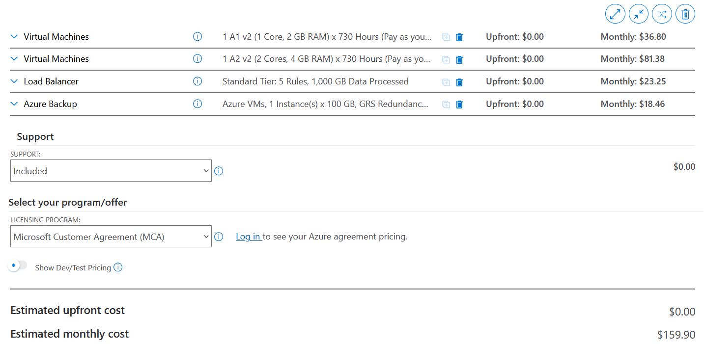

# KN07

## Kostenrechnung erstellen

### Rehosting

#### Screenshot der Kostenrechnungen AWS

#### Screenshot der Kostenrechnungen Azure

#### Erklärung zu der Auswahl, so dass die Auswahl schlüssig ist

Ich habe immer die Region Zürich gewählt, da ich so und meine Firma ideale Ping zeiten kriegen.

Für den Web-Server in der AWS-Instanz habe ich mich für die c6g.medium entschieden, da sie den Traffic optimal bewältigen kann und genau den Anforderungen entspricht. Ähnlich aus Gründen habe ich für den DB-Server eine c6g.large gewählt, da sie auch zur c6g-Familie gehört und gut zur anderen Instanz passt. In Bezug auf den Elastic Load Balancer gab es nicht viele Optionen, daher habe ich mich für 1000 GB Traffic pro Monat entschieden. Für das Backup habe ich lediglich ein EBS-Backup eingerichtet.

Für die Web-Instanz in der Azure-Umgebung habe ich mich für die A1 v2 mit 1 Core und 2 GB RAM entschieden, da sie genau den Anforderungen entspricht. Leider konnte ich jedoch keine 20 GB Speicher auswählen, daher habe ich mich für 32 GB Speicher entschieden. Für den DB-Server habe ich die A1 v2 mit 2 Cores und 4 GB RAM gewählt und ihr 128 GB Speicher zugewiesen. Als Load Balancer habe ich einen Standard Load Balancer mit 5 Regeln und einem monatlichen Traffic von 1000 GB ausgewählt. In Bezug auf die Backup-Instanz habe ich eine virtuelle Maschine geschützt und sichere sie gemäss den Anforderungen.

Ich persönlich tendiere dazu, AWS für meinen Rehosting-Auftrag zu wählen. Dies liegt daran, dass ich monatlich etwa 50 CHF weniger bezahlen würde und gleichzeitig die Möglichkeit habe, Server direkt in Zürich zu nutzen, anstatt sie nur in der nördlichen Schweiz zu haben.

### Replatforming

#### Screenshot der Kostenrechnung

#### Erklärung zu der Auswahl, so dass die Auswahl schlüssig ist.

Da Heroku das Backup und Loadbalancing für mich regelt, zahle ich viel mehr. Trotzdem habe ich mich dafür entschieden, nur eine Datenbank und zwei High-Performance-Webserver zu nutzen. Allerdings müssen wir die Datenbank in eine Postgres-Datenbank umschreiben. Wir zahlen zwar 700 Dollar im Monat, aber dies könnte sich mehr lohnen für eine Firma, da diese nicht von uns gemanagt werden muss. Dadurch können wir weniger Cloud Engineers einstellen.

### Repurchasing

#### Screenshots des Pricings beider Anbieter und Angabe welches ausgewählt wird

#### Erklärung zu der Auswahl, so dass die Auswahl schlüssig ist

##### Zoho

Im Bereich SAAS haben wir immer weniger Optionen. Hier gab es entweder die Enterprise-Option oder die Ultimate-Version. Ich habe festgestellt, dass die Enterprise-Version für mich mehr Nutzen bringt, da ich Funktionen wie einen Email Parser nicht benötige.

##### Sales Cloud

Auch hier habe ich eine ähnliche Denkweise. In diesem Fall hat sich die Enterprise-Version viel mehr gelohnt als die Unlimited-Version, da sie Funktionen bietet, die ich nicht benötige, wie beispielsweise Sales Insights und Premier Success Plan.

#### Gegenüberstellung der SaaS-Lösung zu IaaS und PaaS Lösungen von vorher. Welches wählen Sie und wieso? Was müsste man zusätzlich beachten?

Meine Wahl hängt von meiner Situation ab. Wenn ich nicht viele IT-Experten einstellen möchte, ist eine SaaS-Lösung eine gute Option. Aber wenn mein Unternehmen viele IT-Experten mit Cloud-Kenntnissen hat, wäre wahrscheinlich IaaS die bessere Wahl. Mit IaaS können wir alles selbst verwalten, und es ist oft günstiger.

## Interpretation der Resultate

### wie stark unterscheiden sich die Angebote?

1. SAAS Lösungen:
   - Zoho SAAS: 6'240 Euro pro Jahr für 10 Mitarbeiter.
   - Sales Cloud SAAS: 19'800 Euro pro Jahr für 10 Mitarbeiter. (Teuerste Option)

2. PAAS Lösung:
   - Die PAAS-Lösung kostet 8'400 USD im Jahr für 10 Benutzer. Durch Optimierungen können wir die Kosten um etwa 300 USD pro Monat senken.

3. IAAS Lösung:
   - Die IAAS-Lösung ist mit 1'200 USD im Jahr die kostengünstigste Option.

Die teuerste Option ist definitiv die SAAS Lösung, insbesondere die Sales Cloud SAAS. Die PAAS-Lösung liegt dazwischen und bietet Raum für Kosteneinsparungen. Die IAAS-Lösung ist die preiswerteste, bietet jedoch mehr Kontrolle und erfordert mehr Eigenverantwortung bei der Verwaltung.

### Welches ist das billigste?

Die IAAS Lösung ist definitiv die Billigste.

### Wieso ist eines davon viel teurer? Ist es aber wirklich teurer?

Die PAAS- und SAAS-Lösungen sind teurer, weil sie einen umfassenden Service bieten, bei dem alles für den Nutzer verwaltet wird. Das bedeutet jedoch nicht zwangsläufig, dass sie für ein Unternehmen insgesamt teurer sind. Wenn Sie beispielsweise 2-3 Cloud-Experten benötigen, um eine IAAS-Umgebung zu verwalten, würden diese technisch gesehen etwa 15'000 CHF pro Monat kosten. Dies ist zwar stark vereinfacht dargestellt, aber mit einer SAAS- oder PAAS-Lösung gewinnen Sie mehr Zeit, um sich anderen Herausforderungen zu widmen. Es kommt also darauf an, wie Sie die Gesamtkosten und den Nutzen für Ihr Unternehmen bewerten.

Hier ist eine Grafik, die zeigt, welche Aufgaben von welchem Anbieter erledigt werden:

