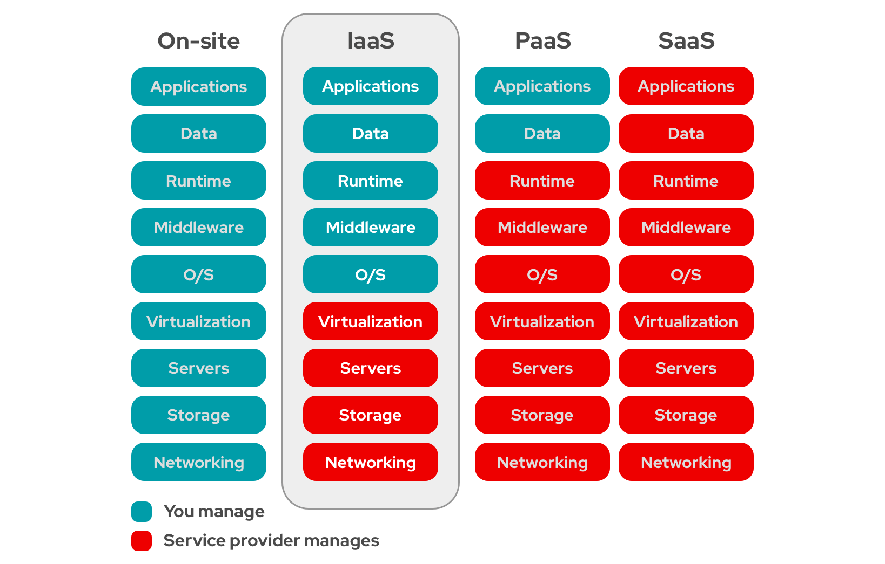

## Cloud computing definition

Cloud computing is the delivery of computing services—including servers, storage, databases, networking, software, analytics, and intelligence—over the Internet (“the cloud”). Companies offering these computing services are called cloud providers.

Some of these providers may differ in services however these providers always include the following services:

| name  | description               |     example             |
|-------|---------------------------|-------------------------|
|IaaS   |Infrastructure as a Service|ec2, s3, vpc             |
|PaaS   |Platform as a Service      |AWS-lambda               |
|SaaS   |Software as a Service      |AWS-Workmain(mailservice)|

## Cloud storage

Cloud storage is a service model in which data is stored on remote servers, which are managed by a cloud storage provider. The cloud storage provider is responsible for maintaining the servers and ensuring that the data is accessible to the users.

## Server definition

A server is a computer designed and engineered to handle huge amounts of request and deliver data to another computer over the internet or local network. These servers are made to guarantee high availability by having redundant network and power supply components.

## Why use cloud computing

There are several reasons as to why exactlly you should use cloud computing here are some of them:

* P4P (pay for performance) this means that you only pay for what ever ressources you need for your service.
* Computing power can be adjusted by using a load balancer.
* Faster to add new resources when you need them.
* Cloud providers maintain, secure and run the computer and facilities for cloud services
* Easier to release application and advertise for them.

## Technology terminology

### Availability Zone
In a region there are many availability zone, each availability zone has its own data center. Availability zones have the following name convention: «Region»«Availability zones»«edge location»

**NOTE** 
Edge locations not always relevant only if CDNS

### Infrastructure as a Service (IaaS)
A model in which virtual machines and servers are used for customers to host a wide range of applications and IT services are provided.

### Latency
The delay before a transfer of data begins after the data has been requested.

### Platform as a Service (PaaS)
A model that provides a virtual platform for customers to create custom software.

### Region
An area where data is stored. Data storage in a Region closest to you us one of the reasons it can be accessed at lightning speed.

### Software as a Service (SaaS)
A model that provides applications using the internet that are managed by a third party.

## Activity 1: Introduction to Cloud Computing

1. Define cloud computing and its impacts.
Cloud computing is a means of delivering/providing computing and application services over the internet. These include storage,databases, networking, analytics and intelligence-over the internet.

2. What is AWS? How does it work? 
AWS comes from Amazon and means Amazon Web services, this service of Amazon specialises in Iaas and PaaS.
3. What is Iaas? Paas ? Saas?

    1. IaaS means Infrastructure as a Service this means that you have to manage alot yourslef, including the following: O/S, Middleware, Runtime, Data, Applications

    2. PaaS means Platform as a Service this means that the cloud service provider provides you with a plattform that can run your stuff meaning data and your applications.

    3. SaaS means Software as a Service

to more clerly visualize this I've linked a graphic in which you can more clearly see how these types differ from eachother:

4. Identify the benefits of cloud computing. 
As I mentioned before there are multiple benefits of using cloud computing:

* P4P (pay for performance) only pay for however much computing power you need.
* Cloud providers maintain, secure and run the computer and facilities for cloud services.
* More cost effective for maintenance and usage
* Lets you scale verticaly and horizontaly based on demand.

## Reflection of Activity 1: Introduction to Cloud Computing

* What is one way that cloud computing has impacted society as a whole? 
Ever since YouTube was announced the internet has become a place for entertainment and not only work. Cloud computing also allows us to store our data everywhere and retrieve it from everywhere. It also lets society work more efficiently, we are not bound to a place anymore, we can work from home, while on the train or on a plane by using MS Office 365.

* Was any of the information surprising or unexpected? 
No not really since it is quite obvious for everyone whos a good judge of character.

* What are some of the sources in which you found your information, and what led you to believe these sources are credible and accurate? 
I found my information on statista aswell as some credible sources such as universities that specialise in information technology and psychology.

## Activity 2: Using Cloud Services

So for this activity I must generate a cloud service usage plan for a number of business case studies.
For this I'll use the following buisness case studies:

1. E-Commerce
2. Healthcare Provider
3. Mobile App Startup
4. Financial Institution

Given these business case studies I will pair/match them with the appropriate number of cloud service models.
I'll use the following cloud service models:

1. IaaS (Infrastructure as a Service)
2. PaaS (Platform as a Service)
3. SaaS (Software as a Service)
4. FaaS (Functions as a Service)

Now starting with the first one E-Commerce

### Cloud service usage plan for E-Commerce
1. **Infrastructure as a Service (IaaS)**
    * Implement auto scaling, will prove useful during high demand
    * Set up virutal machines for web hosting, db mgmt. and caching
    * Use IaaS features to ensure data backup and disaster recovery
2. **Platform as a Service (PaaS)**
    * Developing a custom e-commerce application using either third party programms like shopify or wix or do it yourself
    * Use PaaS Services for database management, reducing the need for manual configuration
    * Take advantage of automatic horizontal scaling and load balancing offered by the PaaS platform.
3. **Software as a Service (SaaS)**
    * Subscribte to SaaS-based email marketing platform for targeted customer communications
    * Utilze SaaS-based customer suppoert system to efficiently handle customer inquiries.
    * Consider using SaaS-based analytics solution to gain insights into user behaviour.
4. **Function as a Service (FaaS)**
    * Implement serverless functions to handle order processing during peak times.
    * Develop event-triggered functions for inventory management and stock replenishment.
    * Use FaaS for automated notifications, such as order status updates and shipping confirmations

Absolutely, let's create cloud service usage plans for the remaining case studies:

### Cloud service usage plan for E-Commerce Healthcare Provider

1. **Infrastructure as a Service (IaaS)**:
   - Utilize IaaS to host electronic health records (EHR) databases securely.
   - Implement data encryption and access controls for HIPAA compliance.
   - Set up virtual machines for telehealth applications and patient portal hosting.

2. **Platform as a Service (PaaS)**:
   - Develop a patient portal using a PaaS environment for easy access to medical records.
   - Deploy healthcare applications on a PaaS platform to simplify deployment and updates.
   - Utilize PaaS for building and testing predictive analytics models for patient outcomes.

3. **Software as a Service (SaaS)**:
   - Subscribe to a SaaS-based appointment scheduling system to streamline patient visits.
   - Utilize SaaS solutions for medical billing and claims management.
   - Consider using SaaS-based collaboration tools for remote medical team communication.

4. **Function as a Service (FaaS)**:
   - Implement FaaS for real-time alerts to medical staff for critical patient events.
   - Develop event-driven functions for prescription refill reminders to patients.
   - Use FaaS to automate data backups and health record updates.

### Cloud service usage plan for E-Commerce Mobile App Startup

1. **Infrastructure as a Service (IaaS)**:
   - Host backend servers and databases on IaaS for flexible scalability.
   - Implement auto-scaling to handle user traffic spikes during app launches.
   - Use IaaS features for regular backups and disaster recovery.

2. **Platform as a Service (PaaS)**:
   - Utilize PaaS for continuous integration and continuous deployment (CI/CD) pipelines.
   - Develop and test app updates in a PaaS development environment.
   - Leverage PaaS services for monitoring app performance and user behavior.

3. **Software as a Service (SaaS)**:
   - Subscribe to a SaaS-based analytics solution to gather insights into user engagement.
   - Utilize SaaS collaboration tools for remote teamwork during app development.
   - Consider using SaaS for user feedback collection and management.

4. **Function as a Service (FaaS)**:
   - Implement serverless functions for push notifications and in-app event handling.
   - Use FaaS to automate backend processes such as user authentication and notifications.
   - Leverage FaaS for implementing user-specific app personalization.

### Cloud service usage plan for E-Commerce Financial Institution

1. **Infrastructure as a Service (IaaS)**:
   - Create isolated networks on IaaS to secure financial applications and data.
   - Host financial data and analytics platforms on IaaS for data-driven decisions.
   - Implement data encryption and access controls for regulatory compliance.

2. **Platform as a Service (PaaS)**:
   - Utilize PaaS for developing and deploying fintech applications like mobile banking.
   - Develop risk assessment models on a PaaS platform for improved decision-making.
   - Leverage PaaS for regulatory reporting and auditing processes.

3. **Software as a Service (SaaS)**:
   - Subscribe to a SaaS-based customer relationship management (CRM) system for client management.
   - Utilize SaaS solutions for compliance management and reporting.
   - Consider using SaaS collaboration tools for inter-department communication.

4. **Function as a Service (FaaS)**:
   - Implement FaaS for real-time fraud detection and prevention.
   - Develop event-triggered functions for trade execution and settlement.
   - Use FaaS for automating routine backend processes in risk management.

## How to identify
To identify each necessity for a business in regards cloud services.
Utlizing this knowledge is crucial in creating a cloud service usage plan, because you need to identify each and every independency and for that you need to know how each service model functions.

### Infrastructure as a Service (IaaS)

**Identification dependencies:**

**Scalability and Hosting Needs:** 
Dependency: The need for scalable and flexible hosting infrastructure.
How it was identified: IaaS is designed for hosting virtualized computing resources, making it suitable for businesses that require the ability to scale resources up or down based on demand.

**Data Security and Compliance:** 
Dependency: Secure hosting environment that adheres to industry regulations.
How it was identified: IaaS platforms offer features for data encryption, access controls, and isolated networks, which are crucial for industries like healthcare and finance that handle sensitive information subject to compliance requirements.

**Customization and Control:** 
Dependency: Requirement for customization and control over the infrastructure.
How it was identified: IaaS allows businesses to configure virtual machines and networks according to their needs, giving them greater control over the environment compared to other service models.

### Platform as a Service (PaaS)

**Identification dependencies:**

**Scalability and Hosting Needs:** 
Dependency: The need for scalable and flexible hosting infrastructure.
How it was identified: IaaS is designed for hosting virtualized computing resources, making it suitable for businesses that require the ability to scale resources up or down based on demand.

**Data Security and Compliance:** 
Dependency: Secure hosting environment that adheres to industry regulations.
How it was identified: IaaS platforms offer features for data encryption, access controls, and isolated networks, which are crucial for industries like healthcare and finance that handle sensitive information subject to compliance requirements.

**Customization and Control:** 
Dependency: Requirement for customization and control over the infrastructure.
How it was identified: IaaS allows businesses to configure virtual machines and networks according to their needs, giving them greater control over the environment compared to other service models.

### Software as a Service (SaaS)

**Scalability and Hosting Needs:** 
Dependency: The need for scalable and flexible hosting infrastructure.
How it was identified: IaaS is designed for hosting virtualized computing resources, making it suitable for businesses that require the ability to scale resources up or down based on demand.

**Data Security and Compliance:** 
Dependency: Secure hosting environment that adheres to industry regulations.
How it was identified: IaaS platforms offer features for data encryption, access controls, and isolated networks, which are crucial for industries like healthcare and finance that handle sensitive information subject to compliance requirements.

**Customization and Control:** 
Dependency: Requirement for customization and control over the infrastructure.
How it was identified: IaaS allows businesses to configure virtual machines and networks according to their needs, giving them greater control over the environment compared to other service models.

### Function as a Service (FaaS)

**Identification of Dependencies:**

**Event-Driven Workflows:** 
Dependency: Need for event-triggered execution of code.
How it was identified: FaaS platforms allow developers to execute code in response to specific events, making it suitable for businesses that require rapid, event-driven responses, such as healthcare alerts or real-time fraud detection.

**Serverless Architecture:** 
Dependency: Desire to avoid server management and scaling concerns.
How it was identified: FaaS abstracts server management, allowing businesses to focus on writing functions and automating processes without worrying about infrastructure provisioning.

**Efficient Resource Utilization:** 
Dependency: Optimizing resource usage and paying only for active execution.
How it was identified: FaaS charges based on the actual execution time of functions, making it efficient for businesses that want to avoid over-provisioning resources.