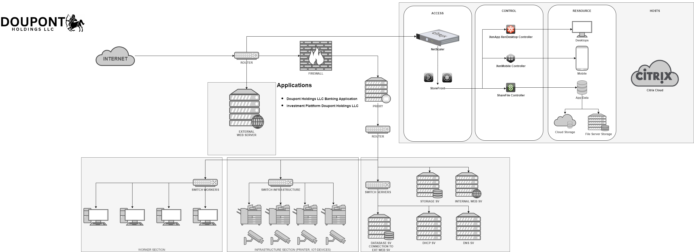

# Analysis of the firm Doupont Holdings LLC

## **General Analysis of the Firm:**

Doupont Holdings LLC is a diversified conglomerate with a notable history of transformation and diversification across different industries. Here is a general analysis of the firm:

1. Historical Evolution:
Doupont Holdings LLC has a remarkable historical journey, initially starting as a pastry vendor during the Great Depression and later diversifying into the finance sector. This evolution showcases the firm's ability to adapt to changing market conditions and its visionary leadership.

2. Diverse Portfolio:
The firm's portfolio is highly diversified, encompassing technology, agriculture, renewable energy, and finance. This diversity reflects a strategic approach to mitigate risks and leverage opportunities across various sectors.

3. Global Presence:
With offices in New York City and Geneva, the firm has established a global presence. This international reach provides access to diverse markets and opportunities for cross-border trade and collaboration.

4. Commitment to Sustainability:
Doupont Holdings LLC has shown a commitment to sustainable business practices, as evident from its acquisition of GreenGro Farms and EcoPower Systems in the agriculture and renewable energy sectors. This commitment aligns with the growing importance of sustainability in today's business landscape.

5. Strategic Acquisitions:
The firm's strategic acquisitions, such as Techtronics Inc. in technology and EuroStock Traders Ltd. in finance, have played a pivotal role in expanding its influence and portfolio. These acquisitions demonstrate the company's forward-thinking approach to stay competitive and relevant.

6. Resilience and Adaptability:
Doupont Holdings has demonstrated resilience and adaptability over the years, as seen in its ability to evolve and thrive in changing economic conditions, including the Great Depression and the dynamic business landscape of the 1970s.

7. Historical Legacy:
The Mille-Feuille patisserie in Geneva holds a special place in the company's history and serves as a symbol of its heritage. This legacy can be leveraged for branding and customer engagement strategies, connecting the company to its historical roots.

In conclusion, Doupont Holdings LLC is a diversified firm with a rich history, a commitment to sustainability, and a global presence. Its ability to adapt, diversify, and make strategic acquisitions has positioned it as a notable player in various industries. This historical and strategic context is essential for developing a cloud computing strategy and determining which applications should be migrated to the cloud.

## **IT Analysis of the Doupont Holdings LLC:**

As a result of Doupont Holdings LLC's numerous acquisitions, the demand for their on-premise server-hosted applications has significantly increased. This surge in usage has created a need for additional power to support their expanding infrastructure. In the business proposal put forth by Éric Doulmont, an attachment outlines the current infrastructure of Doupont Holdings LLC, providing a comprehensive overview of their existing setup.

However, it is important to note that the infrastructure of Doupont Holdings and their acquired firms is separate.

## **Requirements for Their Cloud Platform:**

**a. Scalability:** Given the diverse business units and potential for future acquisitions, the cloud platform must be highly scalable to accommodate growth.

**b. Security:** Security is paramount, especially in the finance sector. Robust security measures and compliance with industry standards are essential.

**c. Performance:** To support the diverse needs of technology, agriculture, renewable energy, and finance, the cloud platform must offer high performance and low latency.

**d. Disaster Recovery:** Business continuity is critical. The cloud platform should include robust disaster recovery and backup solutions to ensure data resilience.

**e. Compliance and Regulation:** Ensure that the cloud platform adheres to financial regulations and industry-specific compliance standards.

## **Applications to Migrate to the Cloud:**

**a. Financial Services Applications:** Migrate DHLLC's financial application to the cloud to enhance scalability, security, and accessibility. This includes core banking systems, trading platforms, and customer-facing applications like online banking.

**b. Agriculture Management Software:** Cloud-based solutions can optimize farming operations, including crop management, irrigation control, and data analytics for sustainable agriculture.

**c. Renewable Energy Monitoring:** Migrate monitoring and data analysis applications for renewable energy sources (solar, wind, etc.) to the cloud. This facilitates real-time monitoring, predictive maintenance, and optimization of energy production.

**d. Technology and Innovation:** Technology-related applications, such as software development tools, collaboration platforms, and data analytics tools, should be hosted on the cloud to support innovation and agility.

**e. Data Analytics:** Implement cloud-based data analytics platforms to analyze and derive insights from data collected across all business units, aiding in better decision-making.

**f. CRM and Customer Engagement:** Deploy cloud-based customer relationship management (CRM) systems to enhance customer engagement in the finance sector and beyond.

**g. Email and Communication:** Move email and communication systems to the cloud to improve employee collaboration and streamline communication across offices in different regions.

**h. HR and Payroll Systems:** Migrate HR and payroll applications to the cloud to standardize and streamline HR processes.

**i. Disaster Recovery Solutions:** Implement cloud-based disaster recovery solutions to ensure data resilience in the event of unexpected disruptions.

**j. IoT and Sensors:** If applicable, utilize the cloud for managing data from IoT devices and sensors in agriculture and renewable energy sectors for real-time insights and automation.

 
    
 <h4>developers note</h4>

For the sake of demonstrating my knowledge and my understanding of the subject I listed every application which could get migrated to the cloud however I won't do that since I simply don't have the knowledge to create these.

Since this is why I'll only make a bare bones web app that should resemble the **Financial Services Applications**.

