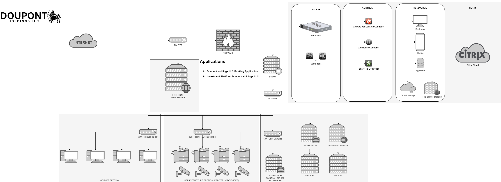
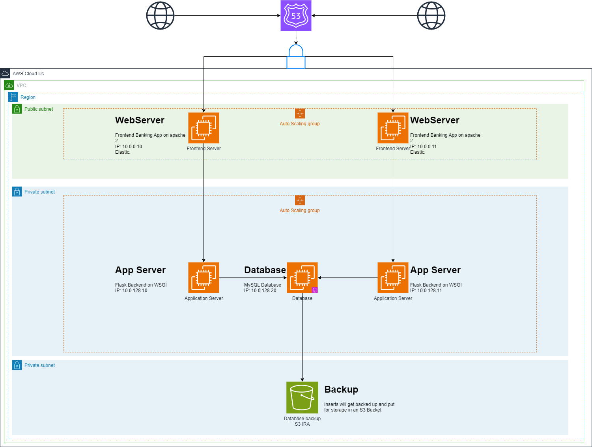

# Conceptulisation 
Based on the infrastructure plan presented by Doupont Holdings' IT Infrastructure Team, I was able to gain a preliminary understanding of their on-premises infrastructure. 

Considering that my primary objective was to migrate the core applications of Doupont Holdings to the cloud, I formulated the following cloud environment infrastructure plan.

## Cloud

This cloud infrastructure plan closely resembles the outdated infrastructure of Doupont Holdings. As you can observe, the traffic is directed through the AWS service Route 53. 

### Functionality

As mentioned earlier, AWS Route 53 will manage and control the traffic routing. This traffic will be subsequently directed to specific EC2 instances based on the load.

Users will have the capability to connect to the web servers, which are located within the public subnet. Each individual web server is assigned an Elastic IP (EIP).

The web server's frontend is designed to communicate with the web application servers. These application servers are situated within a private subnet along with the database they interact with.

Furthermore, this database is also connected to an S3 Bucket located in a separate subnet. The database will routinely create backups that include the inserts made into the database.

### Accessibility
The accessibility to the cloud platform is restricted, as denoted by the 🔒 symbol. This signifies the presence of distinct security groups for each subnet and service type. With just two subnets in use, there are two corresponding security groups.

Consequently, public access to HTTP and HTTPS on the frontend is unrestricted. However, the same does not apply to the backend. In the backend, only requests originating from the public subnet are permitted.

You can see the security group setting at [security group](../G1-security/security-groups.md)