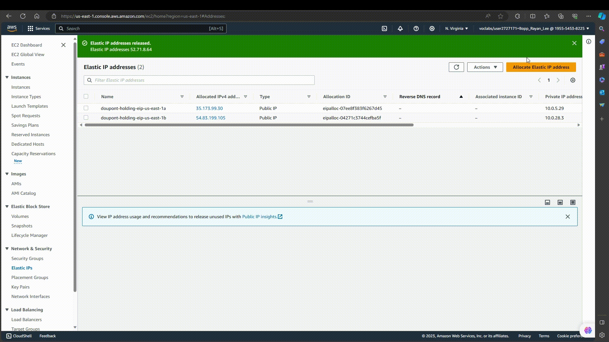

# Elastic IP (EIP) Setup
In this document you will learn what an EIP or Elastic IP is and How to setup one and associate it with an ec2 instance.

## What is an Elastic IP (EIP)?

An Elastic IP (EIP) is a feature provided by cloud computing platforms like Amazon Web Services (AWS). It serves as a static, public IPv4 address that can be dynamically associated with and disassociated from instances in a virtual private cloud (VPC). Unlike the dynamic IP addresses typically assigned to instances, an EIP provides a stable and fixed point of access to your resources within the cloud environment.

## What does an Elastic IP (EIP) do?

Elastic IPs offer several important functions within the context of cloud computing:

1. **Stability**: EIPs provide a consistent, unchanging IP address that remains associated with your resources, even if you stop or start instances. This stability is valuable for scenarios where a predictable public address is necessary.

2. **Redirection**: EIPs enable the redirection of network traffic to instances within a VPC. They can be associated with specific instances, making it possible to reroute traffic or connections seamlessly when needed.

3. **Failover and High Availability**: EIPs can be quickly reassigned to backup instances in the event of instance failure, allowing for high availability and fault tolerance. This is particularly important for applications that require continuous uptime.

4. **Public-Facing Resources**: EIPs are often used for public-facing resources, such as web servers, that require a consistent public IP address for users to access the service reliably.

5. **Network Configuration**: EIPs are configurable, and you can manage them through the cloud platform's console or APIs. This flexibility allows you to adapt to changing requirements and network configurations as needed.

In summary, an Elastic IP (EIP) offers a dependable, publicly accessible IP address for your cloud resources. It plays a crucial role in ensuring the stability, reliability, and high availability of your applications and services hosted within a cloud environment.

## Creating EIP and Associating it with an EC2 instance
In this video you can see how I create a EIP and associate it with the ec2 instance ***web-server-ec2-dhllc-public1-us-east-1a***

