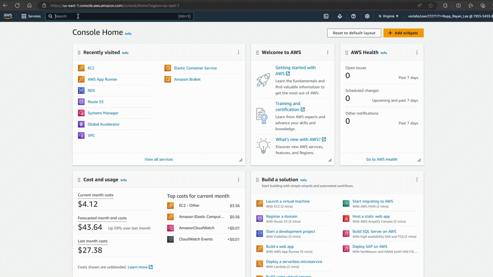
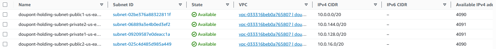

# Setting up VPC
In this markdown document you will learn what a VPC is and how to set one up.

## What is a VPC
A VPC, or Virtual Private Cloud, is a private and customizable network within a cloud platform like AWS. It lets you create, manage, and secure your cloud resources while controlling their network configuration and access rules.

## Finding VPC

Finding a VPC is easy. Once you started up your AWS Learner lab go in the search bar and type in **VPC** this will immediatelty put you into the VPC Dashboard in which you can setup your VPC

## Creating VPC and Subnet

In this GIF I have created a VPC named **doupont-holding-vpc**. This VPC has four Subnets:

- **2 Private Subents**
- **2 Public Subnets**

