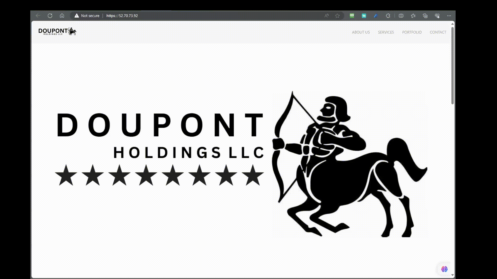

# Installation Packages

## Connect to AWS EC2 Instance over SSH
Here I will show how to setup an ec2 instance to act as a web-server.

#### **Step 1: Locate your .pem or .ppk file**
- First, ensure you have the .pem or .ppk file you previously generated and downloaded. Uf you can't find it, check your Downloads folder.

#### **Step 2: Find the SSH command**


#### **Step 3: Open your Terminal**
- Once you have the SSH command, open a Terminal of your choice. You can usually find Terminal on macOS or use a program like PuTTY on Windows.
<details>
<summary>🚨Important</summary>
If you have downloaded the .ppk you must use PuTTy however if you downloaded the .pem file you can just give the relative path in the terminal.
</details>
<br>

#### **Step 4: Navigate to your Downloads folder**
- In the Terminal, navigate to your Downloads folder using the following command:
```bash
cd Downloads
```

#### **Step 5: Connect to your EC2 Instance**
- Finally, enter the SSH command you obtained earlier. Replace "Valhalla.pem" with the name of your .pem or .ppk file and "ubuntu@ec2-34-194-253-166.compute-1.amazonaws.com" with the appropriate username and public DNS (or IP address) of your EC2 Instance:
  ```bash
  ssh -i "Ragnarok.pem" ubuntu@ec2-34-194-253-166.compute-1.amazonaws.com
  ```

Press Enter to run the command. You may be prompted to confirm the connection by typing "yes" and then entering your passphrase if you set one during the key pair generation.

You should now be connected to your EC2 Instance over SSH. Make sure to replace "Valhalla.pem" and the EC2 Instance address with your specific key file and instance details.

<br>

## Install the necessary packages

#### **Step 1 - Install Apache**
Apache is available with the default ubuntu package manager `apt`.
You can install apache by entering the following commands:

```bash
sudo apt update
```
This command will update the package manager to get the latest packages.

```bash
sudo apt install apache2 -y
```
This command will download the apache2 package and the `-y` option will accept any additional packages automatically

### **Step 2 - Adjusting the Firewall**

Here you don't need to do anything, because you already have a firewall provided by AWS. This is managed over the security groups. See here [📄security group rules](security-group-setup.md#security-group-public)

### **Step 3 - Checking your Web Server**

At the end of the installation process, Ubuntu 20.04 starts Apache. The web server should already be up and running.

Check with the systemd init system to make sure the service is running by typing:

```bash
sudo systemctl status apache2
```

```
● apache2.service - The Apache HTTP Server
     Loaded: loaded (/lib/systemd/system/apache2.service; enabled; vendor preset: enabled)
     Active: active (running) since Fri 2023-10-06 12:42:54 UTC; 17min ago
       Docs: https://httpd.apache.org/docs/2.4/
   Main PID: 2560 (apache2)
      Tasks: 55 (limit: 1141)
     Memory: 5.2M
        CPU: 83ms
     CGroup: /system.slice/apache2.service
             ├─2560 /usr/sbin/apache2 -k start
             ├─2571 /usr/sbin/apache2 -k start
             └─2572 /usr/sbin/apache2 -k start

Oct 06 12:42:54 ip-10-0-0-10 systemd[1]: Starting The Apache HTTP Server...
Oct 06 12:42:54 ip-10-0-0-10 systemd[1]: Started The Apache HTTP Server.
```


As confirmed by this output, the service has started successfully. However, the best way to test this is to request a page from Apache.

#### **Step 4 - Setting Up Virtual Hosts**

When using the Apache web server, you can use virtual hosts (similar to server blocks in Nginx) to encapsulate configuration details and host more than one domain from a single server. We will set up a domain called **dhllc**, but you should **replace this with your own domain name**.

Apache on Ubuntu 20.04 has one server block enabled by default that is configured to serve documents from the ``/var/www/html`` directory. While this works well for a single site, it can become unwieldy if you are hosting multiple sites. Instead of modifying ``/var/www/html``, let’s create a directory structure within ``/var/www`` for a **dhllc** site, leaving ``/var/www/html`` in place as the default directory to be served if a client request doesn’t match any other sites.

Create the directory for **dhllc** as follows:

```bash
sudo mkdir /var/www/dhllc
```

Next, assign ownership of the directory with the ``$USER`` environment variable:

```bash 
sudo chown -R $USER:$USER /var/www/dhllc
```

The permissions of your web roots should be correct if you haven’t modified your umask value, which sets default file permissions. To ensure that your permissions are correct and allow the owner to read, write, and execute the files while granting only read and execute permissions to groups and others, you can input the following command:

```bash
sudo chmod -R 755 /var/www/dhllc
```

Next, create a sample `index.html` page using `nano` or a editor of your choice:

```bash
sudo nano /var/www/dhllc/index.html
```

In order for Apache to serve this content, it’s necessary to create a virtual host file with the correct directives. Instead of modifying the default configuration file located at `/etc/apache2/sites-available/000-default.conf` directly, let’s make a new one at `/etc/apache2/sites-available/dhllc.conf`:

```bash
sudo nano /etc/apache2/sites-available/dhllc.conf
```

Paste in the following configuration block, which is similar to the default, but updated for our new directory and domain name:

```
<VirtualHost *:80>
    ServerAdmin webmaster@localhost
    ServerName dhllc-web
    ServerAlias www.doupont-holdings
    DocumentRoot /var/www/dhllc
    ErrorLog ${APACHE_LOG_DIR}/error.log
    CustomLog ${APACHE_LOG_DIR}/access.log combined
</VirtualHost>
```

Notice that we’ve updated the `DocumentRoot` to our new directory and `ServerAdmin` to an email that the **dhllc** site administrator can access. We’ve also added two directives: `ServerName`, which establishes the base domain that should match for this virtual host definition, and `ServerAlias`, which defines further names that should match as if they were the base name.

Save and close the file when you are finished.

Let’s enable the file with the `a2ensite` tool:

    sudo a2ensite dhllc.conf
Disable the default site defined in 000-default.conf:

    sudo a2dissite 000-default.conf
Next, let’s test for configuration errors:

    sudo apache2ctl configtest
You should receive the following output:

    Output
    Syntax OK
Restart Apache to implement your changes:

    sudo systemctl restart apache2

While this is a viable option, I'd only recommend this if you're only using a static website without having it dynamic. If you plan to deploy a web-app I'd to it by transfering your custom website to an ec2 instance via SCP.


## Transferring Your Custom Website to an EC2 Instance via SCP

You can create your website within Visual Studio Code (VSC) or any code editor of your choice. To upload it to your EC2 Instance, you'll need to use the `scp` command to copy the local files from your PC or laptop.

#### **Step 1: Create a Transfer Folder**

First, create a transfer folder on your EC2 instance with the following command:

```bash
mkdir transfer_folder
```

This will ensure that you won't encounter any permission issues on both your local machine and the EC2 instance.

#### **Step 2: Determine the Path to the Transfer Folder**

Navigate to the transfer folder using the following command (assuming you are in the transfer folder):

```bash
pwd
```

Note down the path for future reference.

#### **Step 3: Copy Your Local Files**

Now, you can copy your local files onto the EC2 instance using the `scp` command. Replace the placeholders as follows:

- `/path/to/your/key`: The path to your SSH key.
- `/path/to/your/folder`: The path to your custom website folder on your local machine.
- `ubuntu@ec2-34-194-253-166.compute-1.amazonaws.com`: The EC2 instance's public DNS.
- `/home/ubuntu/transfer_folder`: The path to the transfer folder on your EC2 instance.

```bash
scp -i "/path/to/your/key" -r /path/to/your/folder ubuntu@ec2-34-194-253-166.compute-1.amazonaws.com:/home/ubuntu/transfer_folder 
```

### Step 4: Verify the Transfer

You can check if the transfer was successful. Once completed, you can delete the old `index.html` file in the appropriate folder location and move your custom website files into place. Your website is now live on your EC2 instance!

Of course you'll need to adjust your config file again.


Et voilà, you're done!



## Securing the connection with SSL-Certificate.

#### **Step 1: Generate a Self-Signed Certificate**

The first step is to generate a self-signed SSL/TLS certificate for your server. You can use the OpenSSL tool to create a self-signed certificate.

Run the following command to generate a self-signed certificate:

```bash
sudo openssl req -x509 -nodes -days 365 -newkey rsa:2048 -keyout /etc/ssl/private/self-signed.key -out /etc/ssl/certs/self-signed.crt
```

This command will create a private key (`self-signed.key`) and a self-signed certificate (`self-signed.crt`) that is valid for 365 days. Adjust the validity period as needed.

#### **Step 2: Configure Your Web Server**

Next, you need to configure your web server (e.g., Apache or Nginx) to use the self-signed certificate. You will need to specify the path to the key and certificate files in your web server configuration.

```apache
sudo nano /etc/apache2/sites-available/default-ssl.conf
```

For Apache, you can edit your virtual host configuration file and add the following lines:

```apache
SSLCertificateFile /etc/ssl/certs/self-signed.crt
SSLCertificateKeyFile /etc/ssl/private/self-signed.key
```

it should look like this:
Note that you should just delete everything in your default-ssl-conf if you're using this method.

```apache
<VirtualHost *:443>
    ServerAdmin webmaster@localhost
    DocumentRoot /var/www/your_domain
    SSLEngine on
    SSLCertificateFile /etc/ssl/certs/selfsigned.crt
    SSLCertificateKeyFile /etc/ssl/private/selfsigned.key
    ...
</VirtualHost>
```

For Nginx, edit your server block configuration file:

```nginx
ssl_certificate /etc/ssl/certs/self-signed.crt;
ssl_certificate_key /etc/ssl/private/self-signed.key;
```

#### **Step 3: Restart Your Web Server**

After configuring your web server, you should restart it to apply the changes. The specific command to restart your web server depends on which one you are using.

For Apache:

```bash
sudo systemctl restart apache2
```

For Nginx:

```bash
sudo systemctl restart nginx
```

assign them

```apache
sudo a2enmod ssl
sudo a2ensite dhllc-ssl
```

to finalize the changes

```apache
sudo systemctl restart apache2
```

#### **Step 4: Access Your Website**

Your self-signed SSL/TLS certificate is now in place. When you visit your website using HTTPS, your browser will show a warning that the certificate is not trusted since it's self-signed. You can choose to proceed and access your website securely.

Remember that self-signed certificates are not suitable for production websites but are useful for testing and development environments.
