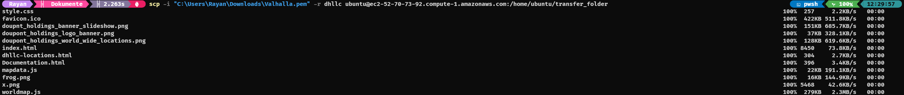
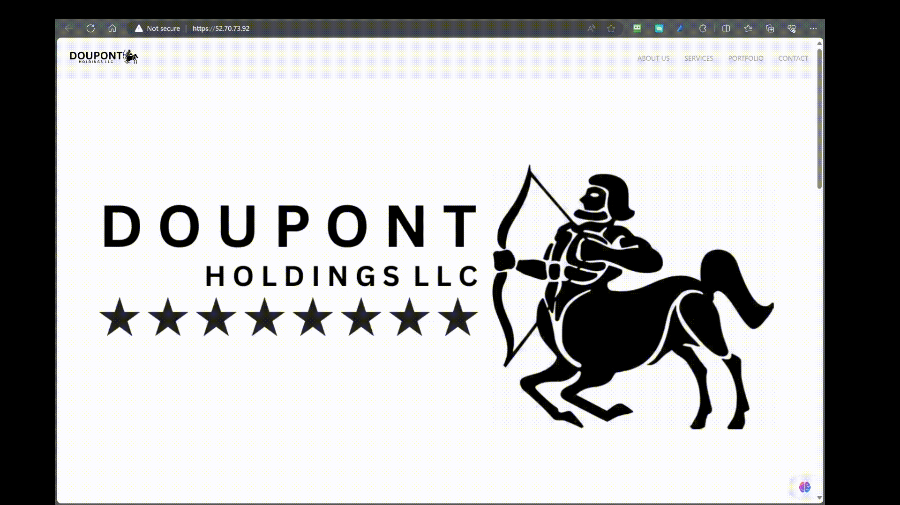

# Installation Packages

## Connect to AWS EC2 Instance over SSH
Here I will show how to setup an ec2 instance to act as a web-server.

#### **Step 1: Locate your .pem or .ppk file**
- First, ensure you have the .pem or .ppk file you previously generated and downloaded. Uf you can't find it, check your Downloads folder.

#### **Step 2: Find the SSH command**


#### **Step 3: Open your Terminal**
- Once you have the SSH command, open a Terminal of your choice. You can usually find Terminal on macOS or use a program like PuTTY on Windows.
<details>
<summary>🚨Important</summary>
If you have downloaded the .ppk you must use PuTTy however if you downloaded the .pem file you can just give the relative path in the terminal.
</details>
<br>

#### **Step 4: Navigate to your Downloads folder**
- In the Terminal, navigate to your Downloads folder using the following command:
```bash
cd Downloads
```

#### **Step 5: Connect to your EC2 Instance**
- Finally, enter the SSH command you obtained earlier. Replace "Valhalla.pem" with the name of your .pem or .ppk file and "ubuntu@ec2-34-194-253-166.compute-1.amazonaws.com" with the appropriate username and public DNS (or IP address) of your EC2 Instance:
  ```bash
  ssh -i "Ragnarok.pem" ubuntu@ec2-34-194-253-166.compute-1.amazonaws.com
  ```

Press Enter to run the command. You may be prompted to confirm the connection by typing "yes" and then entering your passphrase if you set one during the key pair generation.

You should now be connected to your EC2 Instance over SSH. Make sure to replace "Valhalla.pem" and the EC2 Instance address with your specific key file and instance details.

<br>

## Install the necessary packages

#### **Step 1 - Install Apache**
Apache is available with the default ubuntu package manager `apt`.
You can install apache by entering the following commands:

```bash
sudo apt update
```
This command will update the package manager to get the latest packages.

```bash
sudo apt install apache2 -y
```
This command will download the apache2 package and the `-y` option will accept any additional packages automatically

### **Step 2 - Adjusting the Firewall**

Here you don't need to do anything, because you already have a firewall provided by AWS. This is managed over the security groups. See here [📄security group rules](security-group-setup.md#security-group-public)

### **Step 3 - Checking your Web Server**

At the end of the installation process, Ubuntu 20.04 starts Apache. The web server should already be up and running.

Check with the systemd init system to make sure the service is running by typing:

```bash
sudo systemctl status apache2
```

```
● apache2.service - The Apache HTTP Server
     Loaded: loaded (/lib/systemd/system/apache2.service; enabled; vendor preset: enabled)
     Active: active (running) since Fri 2023-10-06 12:42:54 UTC; 17min ago
       Docs: https://httpd.apache.org/docs/2.4/
   Main PID: 2560 (apache2)
      Tasks: 55 (limit: 1141)
     Memory: 5.2M
        CPU: 83ms
     CGroup: /system.slice/apache2.service
             ├─2560 /usr/sbin/apache2 -k start
             ├─2571 /usr/sbin/apache2 -k start
             └─2572 /usr/sbin/apache2 -k start

Oct 06 12:42:54 ip-10-0-0-10 systemd[1]: Starting The Apache HTTP Server...
Oct 06 12:42:54 ip-10-0-0-10 systemd[1]: Started The Apache HTTP Server.
```


As confirmed by this output, the service has started successfully. However, the best way to test this is to request a page from Apache.

#### **Step 4 - Setting Up Virtual Hosts**

When using the Apache web server, you can use virtual hosts (similar to server blocks in Nginx) to encapsulate configuration details and host more than one domain from a single server. We will set up a domain called **dhllc**, but you should **replace this with your own domain name**.

Apache on Ubuntu 20.04 has one server block enabled by default that is configured to serve documents from the ``/var/www/html`` directory. While this works well for a single site, it can become unwieldy if you are hosting multiple sites. Instead of modifying ``/var/www/html``, let’s create a directory structure within ``/var/www`` for a **dhllc** site, leaving ``/var/www/html`` in place as the default directory to be served if a client request doesn’t match any other sites.

Create the directory for **dhllc** as follows:

```bash
sudo mkdir /var/www/dhllc
```

Next, assign ownership of the directory with the ``$USER`` environment variable:

```bash 
sudo chown -R $USER:$USER /var/www/dhllc
```

The permissions of your web roots should be correct if you haven’t modified your umask value, which sets default file permissions. To ensure that your permissions are correct and allow the owner to read, write, and execute the files while granting only read and execute permissions to groups and others, you can input the following command:

```bash
sudo chmod -R 755 /var/www/dhllc
```

Next, create a sample `index.html` page using `nano` or a editor of your choice:

```bash
sudo nano /var/www/dhllc/index.html
```

This is a viable option if you wan't to work with a simple website however if you have a bigger project that needs CSS, JS and all that stuff you'll most likely use the following option.

## Transferring Your Custom Website to an EC2 Instance via SCP

You can create your website within Visual Studio Code (VSC) or any code editor of your choice. To upload it to your EC2 Instance, you'll need to use the `scp` command to copy the local files from your PC or laptop.

#### **Step 1: Create a Transfer Folder**

First, create a transfer folder on your EC2 instance with the following command:

```bash
mkdir transfer_folder
```

This will ensure that you won't encounter any permission issues on both your local machine and the EC2 instance.

#### **Step 2: Determine the Path to the Transfer Folder**

Navigate to the transfer folder using the following command (assuming you are in the transfer folder):

```bash
pwd
```

Note down the path for future reference.

#### **Step 3: Copy Your Local Files**

Now, you can copy your local files onto the EC2 instance using the `scp` command. Replace the placeholders as follows:

- `/path/to/your/key`: The path to your SSH key.
- `/path/to/your/folder`: The path to your custom website folder on your local machine.
- `ubuntu@ec2-34-194-253-166.compute-1.amazonaws.com`: The EC2 instance's public DNS.
- `/home/ubuntu/transfer_folder`: The path to the transfer folder on your EC2 instance.

```bash
scp -i "/path/to/your/key" -r /path/to/your/folder ubuntu@ec2-52-70-73-92.compute-1.amazonaws.com:/home/ubuntu/transfer_folder 
```

### Step 4: Verify the Transfer

You can check if the transfer was successful. Once completed, you can delete the old `index.html` file in the appropriate folder location and move your custom website files into place. Your website is now live on your EC2 instance!



Et voilà, you're done!

