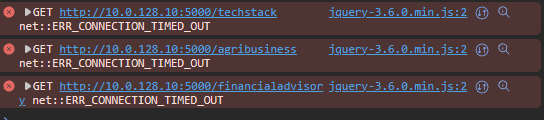

# Proof 
Here is the proof that my configurations work

#### **Frontend: Doupont Holdings**

This proves that my frontend server can serve the information of my customized webpage.

#### **Backend: Doupont Holdings**

this might be a error msg, however it proves that my frontend acknowledges that there is a backend server which serves information. This might be due to a programming error or networking error.

This might be solved by doing the following:

- **1. Adjusting the Security Groups**: This might be solved by adjusting the outgoing/incoming traffic security group configurations.

- **2. Adjusting the Firewall**: This might be solved by adjusting th firewall. This can be done by using the following command:

        ufw allow 5000

Since this is the prot on which the application runs.

#### **Database: Doupont Holdings**

This is the output I've got by executing a script on the app-server. Which communicates with the db-server. This proves that the db-server hold actual information.