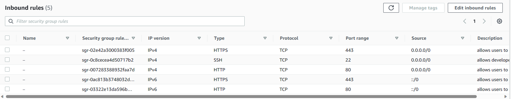
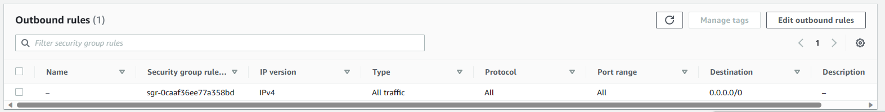
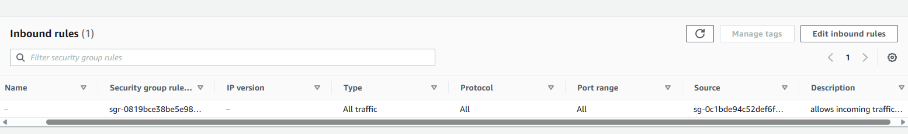
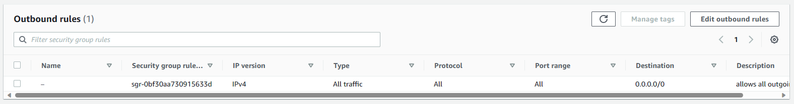

# Security Group Setup
In this document you will get to know how to setup and configure a security group (SG) as well as what a security group is.

## What is a Security Group
A Security Group is a fundamental component of network security within a Virtual Private Cloud (VPC) on Amazon Web Services (AWS) and other cloud platforms. It serves as a virtual firewall that controls inbound and outbound traffic to and from AWS resources, such as EC2 instances. Here's a more detailed explanation:

## What does a Security Group do:

1. **Ingress and Egress Rules**: A Security Group acts like a set of rules that determine what traffic is allowed in and out of AWS resources associated with the Security Group. It defines these rules based on IP addresses, port ranges, and protocols.

2. **Stateful**: Security Groups are stateful, which means that if you allow inbound traffic from a specific IP and port, the corresponding outbound traffic is automatically allowed. This simplifies rule management and reduces configuration complexity.

3. **Layer of Defense**: They provide an essential layer of defense to protect your resources from unauthorized access. By configuring Security Groups properly, you can restrict access to only trusted sources, reducing the attack surface of your resources.

4. **Application-Level Control**: Security Groups are typically applied at the instance level, meaning you can tailor rules to different types of instances. For instance, you can create one Security Group for web servers and another for database servers, each with rules appropriate for their respective functions.

5. **Dynamic Updates**: You can modify Security Group rules at any time. This flexibility allows you to adapt to changing requirements and tighten or loosen security controls as needed.

6. **Default Deny**: By default, a Security Group starts with no inbound traffic allowed, and you must explicitly define the rules to permit access. This follows the security principle of "default deny," where everything is blocked unless explicitly allowed.

In summary, a Security Group is a critical security mechanism that plays a central role in securing your cloud resources within a VPC. It allows you to define traffic rules to control who can access your instances and what traffic is allowed, helping you establish a secure and controlled network environment in the cloud.

## Creating a Security Group

In this gif I demonstrate how to create a security group. In my case I created the security group for the private subnet of doupont holdings vpc.

I allowed all incoming traffic from the public security group and allowed all outgoinf traffic from the private security group/subnet.

## Security group Public

## Security group Private

