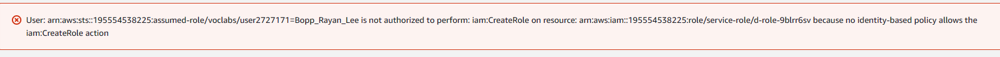

# Backup script

## Creating an S3 Bucket


## Creating a Script
To create the backup I must make a backup-function script:

```py
import boto3
import psycopg2
from psycopg2.extras import RealDictCursor
from io import BytesIO
import datetime

# AWS S3 bucket and database configurations
aws_access_key = 'YOUR_AWS_ACCESS_KEY'
aws_secret_key = 'YOUR_AWS_SECRET_KEY'
aws_s3_bucket = 'your-s3-bucket-name'
db_host = 'your-db-host'
db_name = 'your-db-name'
db_user = 'your-db-user'
db_password = 'your-db-password'

# Establish a connection to the database
conn = psycopg2.connect(host=db_host, database=db_name, user=db_user, password=db_password)
cursor = conn.cursor(cursor_factory=RealDictCursor)

# Create a backup timestamp
timestamp = datetime.datetime.now().strftime('%Y-%m-%d_%H-%M-%S')

# Backup SQL query (adjust this as needed)
backup_query = "SELECT * FROM your_table;"

# Execute the query
cursor.execute(backup_query)
data = cursor.fetchall()

# Generate a SQL dump file in memory
backup_file = BytesIO()
for row in data:
    # You may need to format the INSERT statements based on your database system
    insert_statement = f"INSERT INTO your_table (column1, column2) VALUES ({row['column1']}, '{row['column2']}');\n"
    backup_file.write(insert_statement.encode())

# Connect to S3 and upload the backup file
s3 = boto3.client('s3', aws_access_key_id=aws_access_key, aws_secret_access_key=aws_secret_key)
s3_key = f"backups/{timestamp}_backup.sql"

s3.upload_fileobj(backup_file, aws_s3_bucket, s3_key)

# Close database connections
cursor.close()
conn.close()

print(f"Backup completed and uploaded to S3: s3://{aws_s3_bucket}/{s3_key}")

```

However what I've realised that I cannot make backup scripts. Since I dont have the necessary Information and I cannot access it as well. So I tried this:

```bash
#!/bin/bash

# Database connection and backup parameters
DB_HOST="localhost"
DB_USER="dhllc-adm"
DB_PASSWORD="Abcd12s8rkds!"
DB_NAME="DHLLC_Portfolio"
S3_BUCKET="s3-dhllc-db-backup"
S3_KEY="backup-$(date +\%Y\%m\%d).sql"

# Export MySQL password as an environment variable
export MYSQL_PWD=$DB_PASSWORD

# Dump the database to a file (for MySQL)
mysqldump -h $DB_HOST -u $DB_USER $DB_NAME > /tmp/backup.sql

# Check if mysqldump was successful
if [ $? -eq 0 ]; then
    # Upload the backup file to S3 using the AWS CLI
    aws s3 cp /tmp/backup.sql s3://$S3_BUCKET/$S3_KEY

    # Remove the temporary backup file
    rm /tmp/backup.sql
else
    echo "Database dump failed."
fi
```

This also doesnt work since I dont have permissions, so I tried to create a lambda function and turns out, I also don't have access to that.



Since I dont have that I cannot. Literally cannot create a backup. Unfortunatelly there is nothing I can do, so yeah.


