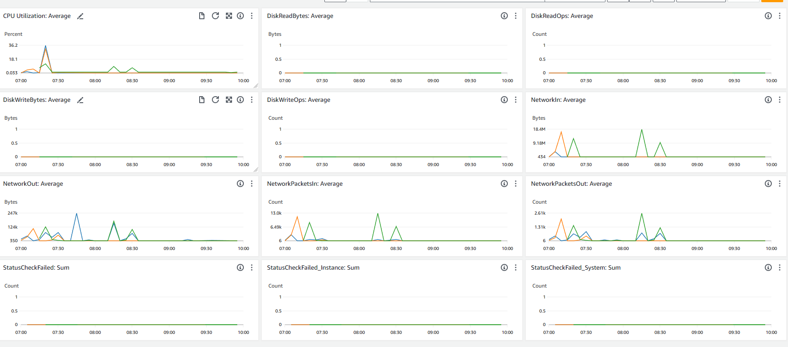
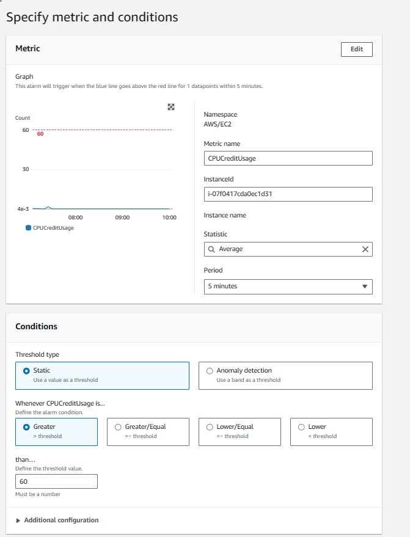
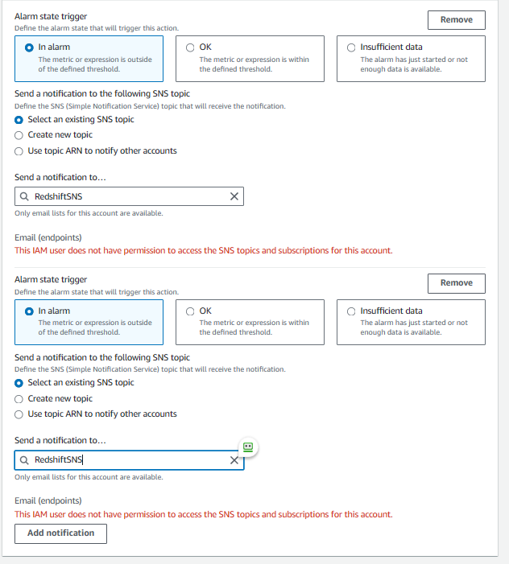
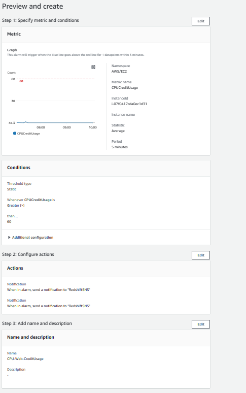

# Cloudwatch

## How to setup

#### **Step 1: Go to your EC2 Instances Dashboard**
Highlight your EC2 instances that you want to monitor and go to the tab "Monitoring" There you'll be able to activate monitoring under "Manage detailed Monitoring".

#### **Step 2: Go to your AWS Cloudwatch Dashboard**
Go and search the AWS Service CloudWatch in the searchbar, then click on Dashboard on the left hand side. After that you want to create a Dashboard. In my case I named it ***dhllc-ec2-monitoring***

What you then want to do is to go back to the dashboard and click on "Automatic Dashboards" In there you have some cool presets. In my case I took the preset "EC2" Which monitors CPU Utilization, DiskReadBytes and other stuff.

After you see your graphs click on the add to dashboard. This will take these values and add them to your dashbaord you previously created.

#### **Proof**

#### **Creating a Alarm** 

I took my web-server instance and said if my Threshhold of 60% CPUCreditUsage gets crossed it sends and alarm to the following address:

Of course I cant configure that to my content since I dont have permissions but whatever.

And now you have created your alarm.