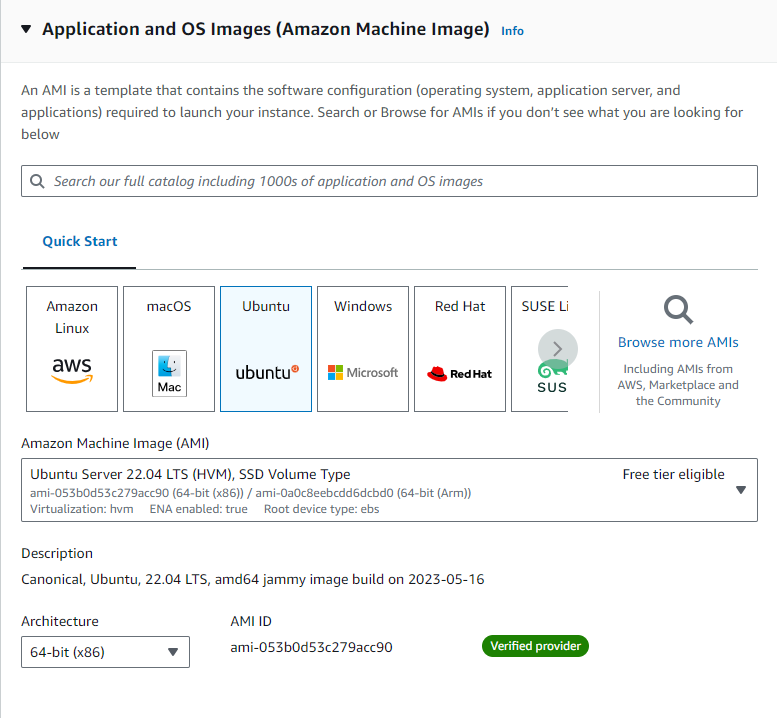
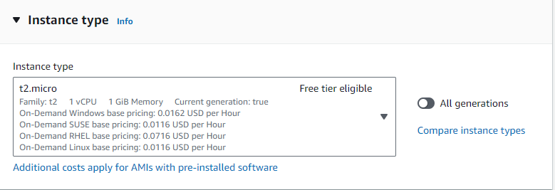
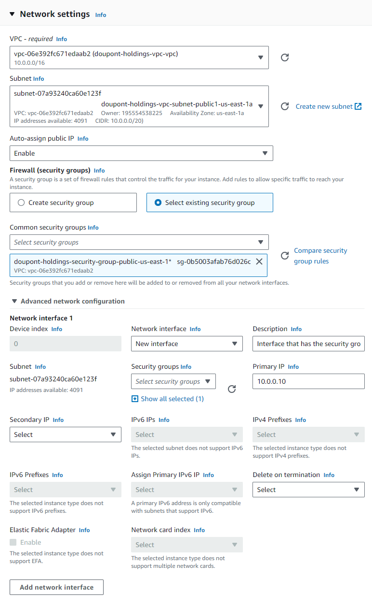
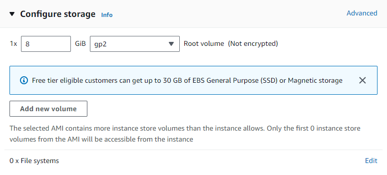

# EC2 Instance Configurations

| object                                    | ID                  | public IP-address | private IP-address | description       |
|-------------------------------------------|---------------------|-------------------|--------------------|-------------------|
| doupont-holdings-ec2-webserver-us-east-1a | i-028052575193fbcbf | 54.83.134.192     | 10.0.0.10          | uses key Valhalla |
|                                           |                     |                   |                    |                   |
|                                           |                     |                   |                    |                   |
|                                           |                     |                   |                    |                   |

## Configurations doupont-holdings-ec2-webserver-us-east-1a
### Applications and OS Images

### Instance type

### Key Pair

### Network configurations

### Storage
