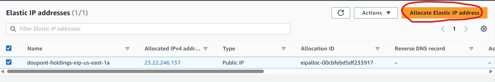
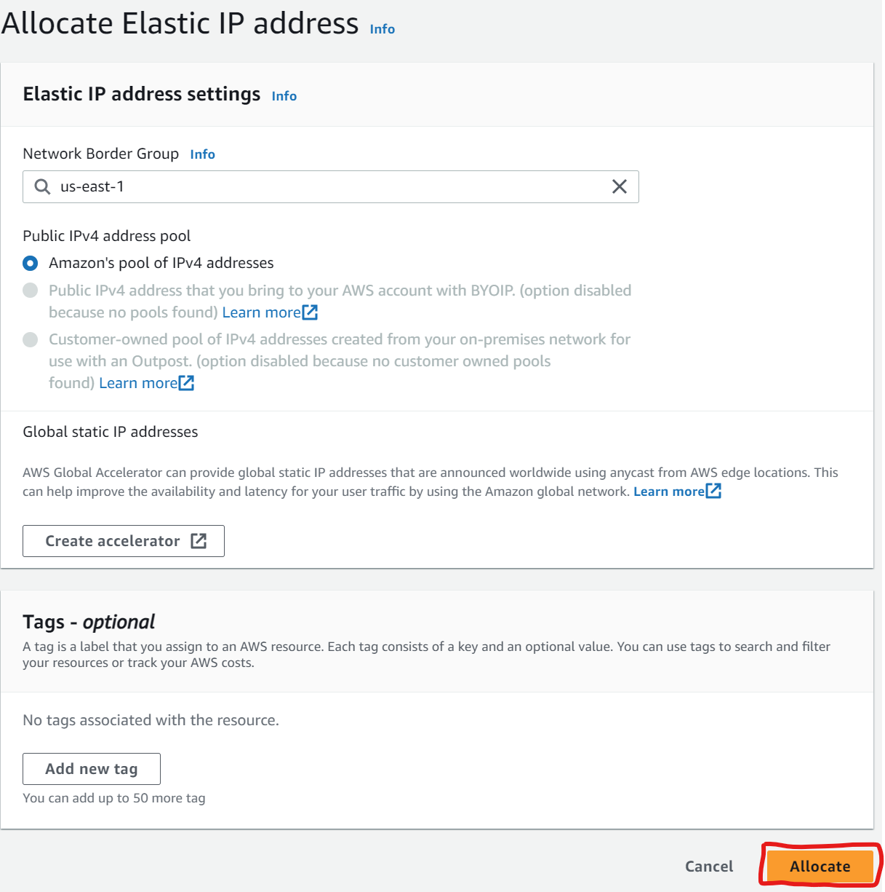
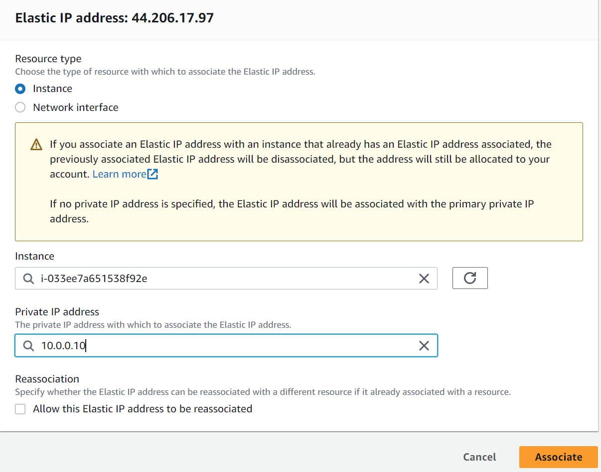

# EC2 Instance Configurations

| object                                    | ID                  | private IP-address | uses elastic IP | public elastic IP-Adress | description                                              |
|-------------------------------------------|---------------------|--------------------|-----------------|--------------------------|----------------------------------------------------------|
| doupont-holdings-ec2-webserver-us-east-1a | i-028052575193fbcbf | 10.0.0.10          | yes             | 52.70.73.92              | uses key Valhalla                                        |
|                                           |                     |                    |                 |                          |                                                          |
|                                           |                     |                    |                 |                          |                                                          |
|                                           |                     |                    |                 |                          |                                                          |

 
    
 <h2>Configurations doupont-holdings-ec2-webserver-us-east-1a</h2>

### Applications and OS Images

### Instance type

### Key Pair

### Network configurations

### Storage

### Elastic IP-Address

### Allocating Elastic IP-Address

### Associating IP-Address

 

