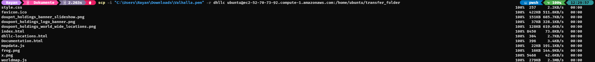
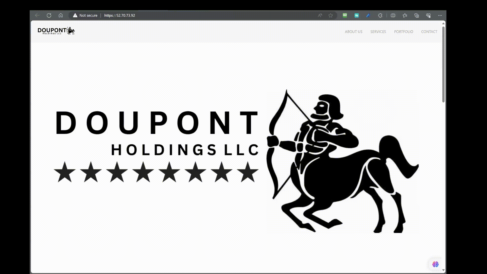
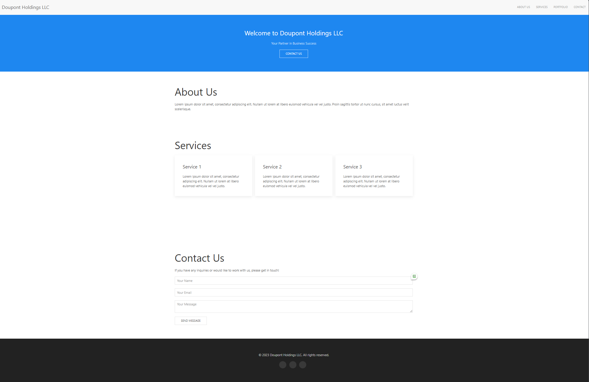

# EC2 Instance packages installation

<details>
<summary><h2>Configuration Doupont Holdings LLC Webserver Apache</h2></summary>


### Connect to AWS EC2 Instance over SSH

### **Step 1: Locate your .pem or .ppk file**
- First, ensure you have the .pem or .ppk file you previously generated and downloaded. If you can't find it, check your Downloads folder.

### **Step 2: Find the SSH command**


### **Step 3: Open your Terminal**
- Once you have the SSH command, open a Terminal of your choice. You can usually find Terminal on macOS or use a program like PuTTY on Windows.
<details>
<summary>🚨Important</summary>
If you have downloaded the .ppk you must use PuTTy however if you downloaded the .pem file you can just give the relative path in the terminal.
</details>
<br>

### **Step 4: Navigate to your Downloads folder**
- In the Terminal, navigate to your Downloads folder using the following command:
  ```bash
  cd Downloads
  ```

### **Step 5: Connect to your EC2 Instance**
- Finally, enter the SSH command you obtained earlier. Replace "Valhalla.pem" with the name of your .pem or .ppk file and "ubuntu@ec2-3-88-72-4.compute-1.amazonaws.com" with the appropriate username and public DNS (or IP address) of your EC2 Instance:
  ```bash
  ssh -i "Valhalla.pem" ubuntu@ec2-3-88-72-4.compute-1.amazonaws.com
  ```

Press Enter to run the command. You may be prompted to confirm the connection by typing "yes" and then entering your passphrase if you set one during the key pair generation.

You should now be connected to your EC2 Instance over SSH. Make sure to replace "Valhalla.pem" and the EC2 Instance address with your specific key file and instance details.

<br>
<br>

## Install the necessary packages

### **Step 1 - Install Apache**
Apache is available with the default ubuntu package manager `apt`.
You can install apache by entering the following commands:

```bash
sudo apt update
```
This command will update the package manager to get the latest packages.

```bash
sudo apt install apache2 -y
```
This command will download the apache2 package and the `-y` option will accept any additional packages automatically


### **Step 2 - Adjusting the Firewall**

Here you don't need to do anything, because you already have a firewall provided by AWS. This is managed over the security groups. See here [📄Network Configurations](network-configurations.md#security-group-public-us-east-1)

### **Step 3 - Checking your Web Server**

At the end of the installation process, Ubuntu 20.04 starts Apache. The web server should already be up and running.

Check with the systemd init system to make sure the service is running by typing:

```bash
sudo systemctl status apache2
```

```
● apache2.service - The Apache HTTP Server
     Loaded: loaded (/lib/systemd/system/apache2.service; enabled; vendor preset: enabled)
     Active: active (running) since Fri 2023-10-06 12:42:54 UTC; 17min ago
       Docs: https://httpd.apache.org/docs/2.4/
   Main PID: 2560 (apache2)
      Tasks: 55 (limit: 1141)
     Memory: 5.2M
        CPU: 83ms
     CGroup: /system.slice/apache2.service
             ├─2560 /usr/sbin/apache2 -k start
             ├─2571 /usr/sbin/apache2 -k start
             └─2572 /usr/sbin/apache2 -k start

Oct 06 12:42:54 ip-10-0-0-10 systemd[1]: Starting The Apache HTTP Server...
Oct 06 12:42:54 ip-10-0-0-10 systemd[1]: Started The Apache HTTP Server.
```


As confirmed by this output, the service has started successfully. However, the best way to test this is to request a page from Apache.

You can access the default Apache landing page to confirm that the software is running properly through your IP address. If you do not know your server’s IP address, you can get it a few different ways from the command line.

Try typing this at your server’s command prompt:

```
curl -4 icanhazip.com
```

when you have your server's IP address, enter it into your browsers search bar:

    http://3.88.72.4

### **Step 4 - Managing the Apache Process**

Now that you have your web server up and running, let’s go over some basic management commands using `systemctl`.

To stop your web server, type:

    sudo systemctl stop apache2
To start the web server when it is stopped, type:

    sudo systemctl start apache2
To stop and then start the service again, type:

    sudo systemctl restart apache2
If you are simply making configuration changes, Apache can often reload without dropping connections. To do this, use this command:

    sudo systemctl reload apache2
By default, Apache is configured to start automatically when the server boots. If this is not what you want, disable this behavior by typing:

    sudo systemctl disable apache2
To re-enable the service to start up at boot, type:

    sudo systemctl enable apache2
Apache should now start automatically when the server boots again.

### **Step 5 - Setting Up Virtual Hosts**

When using the Apache web server, you can use virtual hosts (similar to server blocks in Nginx) to encapsulate configuration details and host more than one domain from a single server. We will set up a domain called **dhllc**, but you should **replace this with your own domain name**.

Apache on Ubuntu 20.04 has one server block enabled by default that is configured to serve documents from the ``/var/www/html`` directory. While this works well for a single site, it can become unwieldy if you are hosting multiple sites. Instead of modifying ``/var/www/html``, let’s create a directory structure within ``/var/www`` for a **dhllc** site, leaving ``/var/www/html`` in place as the default directory to be served if a client request doesn’t match any other sites.

Create the directory for **dhllc** as follows:

```bash
sudo mkdir /var/www/dhllc
```

Next, assign ownership of the directory with the ``$USER`` environment variable:

```bash 
sudo chown -R $USER:$USER /var/www/dhllc
```

The permissions of your web roots should be correct if you haven’t modified your umask value, which sets default file permissions. To ensure that your permissions are correct and allow the owner to read, write, and execute the files while granting only read and execute permissions to groups and others, you can input the following command:

```bash
sudo chmod -R 755 /var/www/dhllc
```

Next, create a sample `index.html` page using `nano` or a editor of your choice:

```bash
sudo nano /var/www/dhllc/index.html
```

Inside, the `index.html` add your html of your liking, for me I used this:

<details>
<summary>📄HTML</summary>

```html


<!DOCTYPE html>
<html lang="en">
<head>
    <meta charset="UTF-8">
    <meta name="viewport" content="width=device-width, initial-scale=1.0">
    <title>Doupont Holdings LLC</title>
    <!-- Include UIkit CSS -->
    <link rel="stylesheet" href="https://cdn.jsdelivr.net/npm/uikit@3.7.6/dist/css/uikit.min.css" />
    <!-- Include UIkit JavaScript -->
    <script src="https://cdn.jsdelivr.net/npm/uikit@3.7.6/dist/js/uikit.min.js"></script>
</head>
<body>
    <!-- Header Section -->
    <header>
        <nav class="uk-navbar-container" uk-navbar>
            <div class="uk-navbar-left">
                <a class="uk-navbar-item uk-logo" href="#">Doupont Holdings LLC</a>
            </div>
            <div class="uk-navbar-right">
                <ul class="uk-navbar-nav">
                    <li><a href="#about">About Us</a></li>
                    <li><a href="#services">Services</a></li>
                    <li><a href="#portfolio">Portfolio</a></li>
                    <li><a href="#contact">Contact</a></li>
                </ul>
            </div>
        </nav>
    </header>

    <!-- Hero Section -->
    <section class="uk-section uk-section-primary uk-light">
        <div class="uk-container">
            <div class="uk-text-center">
                <h2>Welcome to Doupont Holdings LLC</h2>
                <p>Your Partner in Business Success</p>
                <a href="#contact" class="uk-button uk-button-default">Contact Us</a>
            </div>
        </div>
    </section>

    <!-- About Section -->
    <section id="about" class="uk-section">
        <div class="uk-container">
            <h2 class="uk-heading-small">About Us</h2>
            <p>Lorem ipsum dolor sit amet, consectetur adipiscing elit. Nullam ut lorem at libero euismod vehicula vel vel justo. Proin sagittis tortor ut nunc cursus, sit amet luctus velit scelerisque.</p>
        </div>
    </section>

    <!-- Services Section -->
    <section id="services" class="uk-section">
        <div class="uk-container">
            <h2 class="uk-heading-small">Services</h2>
            <div class="uk-child-width-1-3@m uk-grid-small" uk-grid>
                <div>
                    <div class="uk-card uk-card-default uk-card-body">
                        <h3 class="uk-card-title">Service 1</h3>
                        <p>Lorem ipsum dolor sit amet, consectetur adipiscing elit. Nullam ut lorem at libero euismod vehicula vel vel justo.</p>
                    </div>
                </div>
                <div>
                    <div class="uk-card uk-card-default uk-card-body">
                        <h3 class="uk-card-title">Service 2</h3>
                        <p>Lorem ipsum dolor sit amet, consectetur adipiscing elit. Nullam ut lorem at libero euismod vehicula vel vel justo.</p>
                    </div>
                </div>
                <div>
                    <div class="uk-card uk-card-default uk-card-body">
                        <h3 class="uk-card-title">Service 3</h3>
                        <p>Lorem ipsum dolor sit amet, consectetur adipiscing elit. Nullam ut lorem at libero euismod vehicula vel vel justo.</p>
                    </div>
                </div>
            </div>
        </div>
    </section>

    <!-- Portfolio Section -->
    <section id="portfolio" class="uk-section">
        <div class="uk-container">
            <!-- Add your portfolio items here -->
        </div>
    </section>

    <!-- Contact Section -->
    <section id="contact" class="uk-section">
        <div class="uk-container">
            <h2 class="uk-heading-small">Contact Us</h2>
            <p>If you have any inquiries or would like to work with us, please get in touch!</p>
            <form class="uk-form-stacked">
                <div class="uk-margin">
                    <input class="uk-input" type="text" placeholder="Your Name" required>
                </div>
                <div class="uk-margin">
                    <input class="uk-input" type="email" placeholder="Your Email" required>
                </div>
                <div class="uk-margin">
                    <textarea class="uk-textarea" placeholder="Your Message" required></textarea>
                </div>
                <button class="uk-button uk-button-default" type="submit">Send Message</button>
            </form>
        </div>
    </section>

    <!-- Footer Section -->
    <footer class="uk-section uk-section-secondary uk-light">
        <div class="uk-container uk-text-center">
            <p>&copy; 2023 Doupont Holdings LLC. All rights reserved.</p>
            <div>
                <!-- Add your social media icons here using UIkit icons -->
                <a href="#" class="uk-icon-button uk-margin-small-right" uk-icon="icon: facebook"></a>
                <a href="#" class="uk-icon-button uk-margin-small-right" uk-icon="icon: twitter"></a>
                <a href="#" class="uk-icon-button uk-margin-small-right" uk-icon="icon: linkedin"></a>
            </div>
        </div>
    </footer>
</body>
</html>

```
</details>


<details>
<summary>📄🚨 Important Note for Website</summary>

## Transferring Your Custom Website to an EC2 Instance via SCP

You can create your website within Visual Studio Code (VSC) or any code editor of your choice. To upload it to your EC2 Instance, you'll need to use the `scp` command to copy the local files from your PC or laptop.

### Step 1: Create a Transfer Folder

First, create a transfer folder on your EC2 instance with the following command:

```bash
mkdir transfer_folder
```

This will ensure that you won't encounter any permission issues on both your local machine and the EC2 instance.

### Step 2: Determine the Path to the Transfer Folder

Navigate to the transfer folder using the following command (assuming you are in the transfer folder):

```bash
pwd
```

Note down the path for future reference.

### Step 3: Copy Your Local Files

Now, you can copy your local files onto the EC2 instance using the `scp` command. Replace the placeholders as follows:

- `/path/to/your/key`: The path to your SSH key.
- `/path/to/your/folder`: The path to your custom website folder on your local machine.
- `ubuntu@ec2-52-70-73-92.compute-1.amazonaws.com`: The EC2 instance's public DNS.
- `/home/ubuntu/transfer_folder`: The path to the transfer folder on your EC2 instance.

```bash
scp -i "/path/to/your/key" -r /path/to/your/folder ubuntu@ec2-52-70-73-92.compute-1.amazonaws.com:/home/ubuntu/transfer_folder 
```

### Step 4: Verify the Transfer

You can check if the transfer was successful. Once completed, you can delete the old `index.html` file in the appropriate folder location and move your custom website files into place. Your website is now live on your EC2 instance!



Et voilà, you're done!



---

</details>

<br>

Save and close the file when you are finished by pressing `CTRL + X`.

In order for Apache to serve this content, it’s necessary to create a virtual host file with the correct directives. Instead of modifying the default configuration file located at `/etc/apache2/sites-available/000-default.conf` directly, let’s make a new one at `/etc/apache2/sites-available/dhllc.conf`:

```bash
sudo nano /etc/apache2/sites-available/dhllc.conf
```

Paste in the following configuration block, which is similar to the default, but updated for our new directory and domain name:

```
<VirtualHost *:80>
    ServerAdmin webmaster@localhost
    ServerName dhllc-web
    ServerAlias www.doupont-holdings
    DocumentRoot /var/www/dhllc
    ErrorLog ${APACHE_LOG_DIR}/error.log
    CustomLog ${APACHE_LOG_DIR}/access.log combined
</VirtualHost>
```

Notice that we’ve updated the `DocumentRoot` to our new directory and `ServerAdmin` to an email that the **dhllc** site administrator can access. We’ve also added two directives: `ServerName`, which establishes the base domain that should match for this virtual host definition, and `ServerAlias`, which defines further names that should match as if they were the base name.

Save and close the file when you are finished.

Let’s enable the file with the `a2ensite` tool:

    sudo a2ensite your_domain.conf
Disable the default site defined in 000-default.conf:

    sudo a2dissite 000-default.conf
Next, let’s test for configuration errors:

    sudo apache2ctl configtest
You should receive the following output:

    Output
    Syntax OK
Restart Apache to implement your changes:

    sudo systemctl restart apache2
    
Apache should now be serving your domain name. You can test this by navigating to `http://Server-IP`, where you should see something like this:



### **Step 6 - Securing the connection**
You have successfully completed step 5, which means your custom website is now up and running on your Apache2 web server. However, there is one crucial issue remaining – your website lacks a secure connection, currently operating on HTTP. Fortunately, rectifying this is a straightforward process, with two viable options available.

- **Option 1**: If you have a domain, you can utilize Certbot to secure your website with a valid SSL certificate.

- **Option 2**: If you don't have a domain, you can opt for a self-signed certificate to establish a basic level of security for your website.

Please choose the option that best suits your needs and proceed accordingly to enhance the security of your website.

<details>
<summary>Important Note</summary>

If you own a domain such as `doupont-holdings.com` or `it-ology.ch`, you have the flexibility to select between two available options: Certbot and self-signed certificates. I highly recommend opting for Certbot in this case, as it offers a more robust and trusted solution for securing your website.

However, if you do not possess a domain, your sole viable choice is to utilize a self-signed certificate to establish a secure connection for your website.

</details>


<details>
    <summary><h3><strong>Setup CertBot on Amazon Linux</strong></h3></summary>

### Step 1: Update Package Manager

The first step is to ensure that your package manager is up-to-date. This is important to ensure that you have access to the latest packages and security updates. 

Run the following command to update the package manager:

```bash
sudo yum update
```

This command will check for available updates and prompt you to confirm the installation. Enter 'y' if prompted to proceed with the update.

### Step 2: Install CertBot

Once your package manager is updated, you can proceed to install CertBot. CertBot can be installed via the EPEL (Extra Packages for Enterprise Linux) repository, so you'll need to enable it first.

Enable the EPEL repository with the following command:

```bash
sudo amazon-linux-extras install epel
```

Now, you can install CertBot and its Apache plugin (if you are using Apache) using the following command:

```bash
sudo yum install certbot python2-certbot-apache
```

CertBot and the Apache plugin are now installed on your server.

### Step 3: Configure CertBot

CertBot is now installed, but you'll need to configure it for your specific web server and domain. This configuration will vary depending on whether you're using Apache or another web server. Refer to the official CertBot documentation for detailed instructions on configuring CertBot for your specific setup.

### Step 4: Obtain SSL/TLS Certificates

After configuring CertBot, you can use it to obtain SSL/TLS certificates for your domain. Run the following command to request a certificate and follow the on-screen instructions:

```bash
sudo certbot --apache
```

CertBot will interactively ask you to select the domains you want to secure and make necessary configurations.

### Step 5: Automatically Renew Certificates (Optional)

It's important to automatically renew your SSL/TLS certificates to ensure they remain valid. CertBot can set up a cron job to handle certificate renewals automatically. To do this, run:

```bash
sudo certbot renew --dry-run
```

This will simulate the renewal process to ensure it's working correctly. If successful, CertBot will automatically renew your certificates when they are close to expiration.

</details>


<details>
    <summary><h3><strong>Setup CertBot on Ubuntu</strong></h3></summary>

### Step 1: Update Package Manager

The first step is to ensure that your package manager is up-to-date. This is important to ensure that you have access to the latest packages and security updates.

Run the following command to update the package manager:

```bash
sudo apt update
```

This command will check for available updates and prompt you to confirm the installation. Enter 'y' if prompted to proceed with the update.

### Step 2: Install CertBot

Once your package manager is updated, you can proceed to install CertBot. CertBot is available in the default Ubuntu repositories, so you can install it directly with the following command:

```bash
sudo apt install certbot
```

CertBot is now installed on your server.

### Step 3: Configure CertBot

CertBot is now installed, but you'll need to configure it for your specific web server and domain. This configuration will vary depending on whether you're using Apache, Nginx, or another web server. Refer to the official CertBot documentation for detailed instructions on configuring CertBot for your specific setup.

### Step 4: Obtain SSL/TLS Certificates

After configuring CertBot, you can use it to obtain SSL/TLS certificates for your domain. Run the following command to request a certificate and follow the on-screen instructions:

```bash
sudo certbot --apache
```

Or, if you are using Nginx:

```bash
sudo certbot --nginx
```

CertBot will interactively ask you to select the domains you want to secure and make necessary configurations.

### Step 5: Automatically Renew Certificates (Optional)

It's important to automatically renew your SSL/TLS certificates to ensure they remain valid. CertBot can set up a systemd timer to handle certificate renewals automatically. To do this, run:

```bash
sudo systemctl enable certbot.timer
```

This will set up a scheduled task to renew your certificates when they are close to expiration.

You can also manually test the renewal process by running:

```bash
sudo certbot renew --dry-run
```

This will simulate the renewal process to ensure it's working correctly. If successful, CertBot will automatically renew your certificates when they are close to expiration.

</details>

<details>
    <summary><h3><strong>Setup Self-Signed SSL/TLS Certificate on Ubuntu</strong></h3></summary>

### Step 1: Generate a Self-Signed Certificate

The first step is to generate a self-signed SSL/TLS certificate for your server. You can use the OpenSSL tool to create a self-signed certificate.

Run the following command to generate a self-signed certificate:

```bash
sudo openssl req -x509 -nodes -days 365 -newkey rsa:2048 -keyout /etc/ssl/private/self-signed.key -out /etc/ssl/certs/self-signed.crt
```

This command will create a private key (`self-signed.key`) and a self-signed certificate (`self-signed.crt`) that is valid for 365 days. Adjust the validity period as needed.

### Step 2: Configure Your Web Server

Next, you need to configure your web server (e.g., Apache or Nginx) to use the self-signed certificate. You will need to specify the path to the key and certificate files in your web server configuration.

```apache
sudo nano /etc/apache2/sites-available/default-ssl.conf
```

For Apache, you can edit your virtual host configuration file and add the following lines:

```apache
SSLCertificateFile /etc/ssl/certs/self-signed.crt
SSLCertificateKeyFile /etc/ssl/private/self-signed.key
```

it should look like this:

```apache
<VirtualHost *:443>
    ServerAdmin webmaster@localhost
    DocumentRoot /var/www/your_domain
    SSLEngine on
    SSLCertificateFile /etc/ssl/certs/selfsigned.crt
    SSLCertificateKeyFile /etc/ssl/private/selfsigned.key
    ...
</VirtualHost>
```

For Nginx, edit your server block configuration file:

```nginx
ssl_certificate /etc/ssl/certs/self-signed.crt;
ssl_certificate_key /etc/ssl/private/self-signed.key;
```

### Step 3: Restart Your Web Server

After configuring your web server, you should restart it to apply the changes. The specific command to restart your web server depends on which one you are using.

For Apache:

```bash
sudo systemctl restart apache2
```

For Nginx:

```bash
sudo systemctl restart nginx
```

assign them

```apache
sudo a2enmod ssl
sudo a2ensite default-ssl
```

to finalize the changes

```apache
sudo systemctl restart apache2
```

### Step 4: Access Your Website

Your self-signed SSL/TLS certificate is now in place. When you visit your website using HTTPS, your browser will show a warning that the certificate is not trusted since it's self-signed. You can choose to proceed and access your website securely.

Remember that self-signed certificates are not suitable for production websites but are useful for testing and development environments.

</details>
</details>

