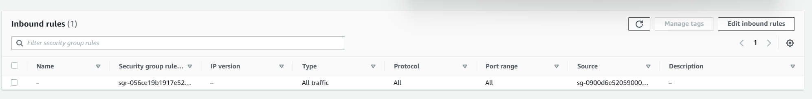
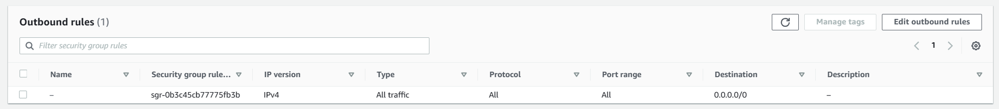
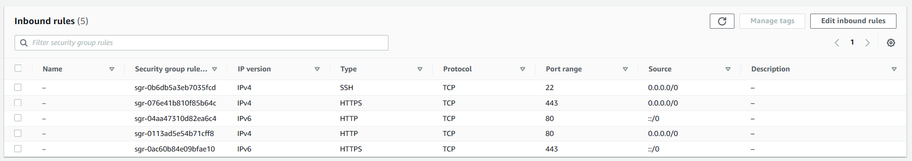
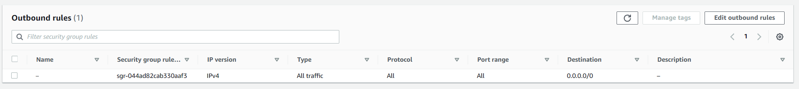

# VPC Konfigurations
Configurations I made regarding the VPC

## VPC Subent

| Name                                        | Subnet ID                | State     | VPC                                           | IPv4 CIDR    | IPv6 CIDR  | Available IPv4 addresses  | Availability Zone  | Availability Zone ID  | Network border group  | Route table                                                       | Network ACL           | Default subnet  | Auto-assign public IPv4 address  | Auto-assign customer-owned IPv4 address  | Customer-owned IPv4 pool  | Auto-assign IPv6 address  | Owner ID     |
|---------------------------------------------|--------------------------|-----------|-----------------------------------------------|--------------|------------|---------------------------|--------------------|-----------------------|-----------------------|-------------------------------------------------------------------|-----------------------|-----------------|----------------------------------|------------------------------------------|---------------------------|---------------------------|--------------|
| doupont-holdings-subnet-public2-us-east-1b  | subnet-03aebcec1662f4434 | Available | vpc-0d79a547f05e2389c \| doupont-holdings-vpc | 10.0.4.0/22  | –          | 1019                      | us-east-1b         | use1-az1              | us-east-1             | rtb-0708826672546e772 \| doupont-holdings-rtb-public              | acl-0d4e78fab1c2f4d7d | No              | No                               | No                                       | -                         | No                        | 195554538225 |
| doupont-holdings-subnet-public1-us-east-1a  | subnet-01465e025d145578d | Available | vpc-0d79a547f05e2389c \| doupont-holdings-vpc | 10.0.0.0/22  | –          | 1018                      | us-east-1a         | use1-az6              | us-east-1             | rtb-0708826672546e772 \| doupont-holdings-rtb-public              | acl-0d4e78fab1c2f4d7d | No              | No                               | No                                       | -                         | No                        | 195554538225 |
| doupont-holdings-subnet-private2-us-east-1b | subnet-0af4a8c128da763ff | Available | vpc-0d79a547f05e2389c \| doupont-holdings-vpc | 10.0.36.0/22 | –          | 1019                      | us-east-1b         | use1-az1              | us-east-1             | rtb-03a44de80499dc7cc \| doupont-holdings-rtb-private2-us-east-1b | acl-0d4e78fab1c2f4d7d | No              | No                               | No                                       | -                         | No                        | 195554538225 |
| doupont-holdings-subnet-private1-us-east-1a | subnet-0604df536e7fe750e | Available | vpc-0d79a547f05e2389c \| doupont-holdings-vpc | 10.0.32.0/22 | –          | 1019                      | us-east-1a         | use1-az6              | us-east-1             | rtb-03b933873d87fa8b0 \| doupont-holdings-rtb-private1-us-east-1a | acl-0d4e78fab1c2f4d7d | No              | No                               | No                                       | -                         | No                        | 195554538225 |

## Security Groups

| Name | Security group ID | Security group name  | VPC ID                                             | Description           | Owner                                                                   | Inbound rules count | Outbound rules count |                    |
|------|-------------------|----------------------|----------------------------------------------------|-----------------------|-------------------------------------------------------------------------|---------------------|----------------------|--------------------|
|      | –                 | sg-0c904ed52ca0411b6 | doupont-holdings-security-group-public-us-east-1*  | vpc-0d79a547f05e2389c | The Security Group for services and instances in the public subent area | 195554538225        | 5 Permission entries | 1 Permission entry |
|      | –                 | sg-038606f48f0a2d8b3 | doupont-holdings-security-group-private-us-east-1* | vpc-0d79a547f05e2389c | The security group for services and instances in private subnet         | 195554538225        | 1 Permission entry   | 1 Permission entry |

### sg-025881bd78da765b2 - doupont-holdings-security-group-private-us-east-1*

### sg-0900d6e52059000f0 - doupont-holdings-security-group-public-us-east-1*

